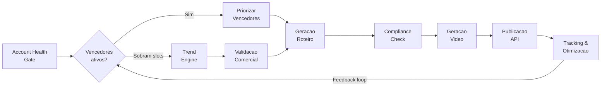

<p align="center">
  
  
  
  
  
</p>

<h1 align="center">AIAfiliado</h1>

<p align="center">
  <strong>Plataforma autonoma de video marketing por afiliacao</strong><br>
  Detecta tendencias virais, gera videos com IA e publica automaticamente em TikTok, Instagram e YouTube.
</p>

---

## Como Funciona

O AIAfiliado opera como um **pipeline adaptativo diario** — um motor autonomo que transforma tendencias virais em videos curtos monetizados via afiliacao, sem intervencao manual.



**O ciclo em 6 passos:**

1. **Account Health Gate** — Avalia risco da conta e define quantos posts sao seguros hoje
2. **Priorizacao** — Produtos com vendas comprovadas (vencedores) tem prioridade sobre tendencias novas
3. **Trend Engine** — Coleta tendencias do TikTok Creative Center e Google Trends para preencher slots restantes
4. **Geracao de Conteudo** — LLM gera roteiros com variantes A/B, compliance automatizado e anti-duplicacao
5. **Video + Publicacao** — HeyGen produz videos com avatar realista, publicados via APIs oficiais
6. **Feedback Loop** — Metricas de performance alimentam as decisoes de producao do dia seguinte

---

## Stack Tecnologica

| Camada | Tecnologia |
|---|---|
| **Linguagem** | Python 3.11+ |
| **Orquestracao** | Celery + Redis |
| **Banco de Dados** | PostgreSQL |
| **Cloud** | Railway (PostgreSQL, Redis, S3-compatible Buckets, Cron Jobs) |
| **Video** | HeyGen API (avatar realista) |
| **LLM** | GPT-4o-mini / Claude Haiku |
| **Dashboard** | Streamlit + Plotly |
| **Publicacao** | TikTok Content Posting API, Instagram Graph API, YouTube Data API |
| **Afiliados** | TikTok Shop, Hotmart, Monetizze, Amazon Associates, Shopee |
| **CI/CD** | GitHub Actions + Railway CLI |

---

## Arquitetura

```
src/
├── app/                        # Core da aplicacao
│   ├── config.py               # Configuracoes (pydantic-settings + env vars)
│   ├── celery_app.py           # Celery + Redis (TLS-ready)
│   ├── cloudwatch.py           # Emissao de metricas (structured logging)
│   ├── healthcheck.py          # Health endpoint (DB + Redis + Celery)
│   ├── cli.py                  # CLI para comandos manuais
│   └── logging.py              # Logging estruturado (structlog)
├── dashboard/                  # Streamlit Dashboard (6 paginas)
│   ├── app.py                  # Entry point + sidebar + routing
│   ├── config.py               # DashboardSettings
│   ├── data/queries.py         # ~25 queries SQLAlchemy (read-only)
│   ├── components/             # KPI cards, Plotly charts, filtros
│   └── pages/                  # overview, pipeline, performance, products, financeiro, health
├── models/                     # 7 modelos SQLAlchemy 2.0
│   ├── daily_run.py            # Registro de execucao diaria
│   ├── trend.py                # Tendencias detectadas
│   ├── product.py              # Produtos validados
│   ├── script.py               # Roteiros gerados
│   ├── video.py                # Videos produzidos
│   ├── publication.py          # Publicacoes realizadas
│   └── metric.py               # Metricas coletadas
└── services/                   # 9 servicos (Celery tasks)
    ├── orchestrator.py         # Pipeline diario (coordena tudo)
    ├── account_health.py       # Scoring de risco e limites
    ├── trend_engine.py         # Coleta e ranking de tendencias
    ├── product_service.py      # Validacao comercial de produtos
    ├── script_service.py       # Geracao de roteiros via LLM
    ├── compliance.py           # Validacao de conteudo (blocklist + LLM)
    ├── video_service.py        # Geracao de video (HeyGen)
    ├── publish_service.py      # Publicacao multi-plataforma
    └── analytics_service.py    # Tracking, A/B e feedback loop
```

---

## Quick Start

### Pre-requisitos

- Docker e Docker Compose
- Git

### 1. Clonar e configurar

```bash
git clone https://github.com/vinimpm/AIAfiliado.git
cd AIAfiliado

cp .env.example .env
# Editar .env com suas API keys (HeyGen, OpenAI, TikTok, etc.)
```

### 2. Subir o ambiente

```bash
docker compose up -d
```

Isso inicia PostgreSQL, Redis, o worker Celery e o Dashboard (http://localhost:8501).

### 3. Rodar migrations

```bash
docker compose exec worker alembic upgrade head
```

### 4. Executar o pipeline manualmente

```bash
docker compose exec worker python -m app.cli trigger_pipeline
```

### 5. Acessar o Dashboard

Abra http://localhost:8501 no navegador. O dashboard atualiza automaticamente a cada 60s.

Para rodar localmente (sem Docker):

```bash
cd src && PYTHONPATH=. streamlit run dashboard/app.py
```

### 6. Acompanhar logs

```bash
docker compose logs -f worker
```

---

## Testes

```bash
# Criar venv
python -m venv .venv

# Ativar (Windows)
.venv\Scripts\activate

# Ativar (Linux/Mac)
source .venv/bin/activate

# Instalar dependencias
pip install -r requirements.txt

# Rodar testes
PYTHONPATH=src ENV=test pytest tests/ -v
```

**104 testes** cobrindo os servicos principais:

| Modulo | Testes | O que valida |
|---|---|---|
| `test_account_health.py` | 37 | Scoring de risco, decay, classificacao de niveis |
| `test_analytics_service.py` | 15 | Pausa, aposentadoria, A/B winner |
| `test_compliance.py` | 19 | Blocklist, CTA por plataforma, duracao |
| `test_product_service.py` | 15 | Validacao comercial, score, limites semanais |
| `test_script_service.py` | 6 | Hash SHA-256, similaridade coseno, anti-duplicacao |

---

## Deploy (Railway)

### Setup no Railway

1. Criar projeto no [Railway Dashboard](https://railway.app/dashboard)
2. Adicionar **PostgreSQL** (1 clique)
3. Adicionar **Redis** (1 clique)
4. Adicionar **Storage Bucket** (1 clique, S3-compatible)
5. Criar 3 services do mesmo repo: **worker**, **beat**, **dashboard**
6. Criar 1 **cron job** para trigger do pipeline diario
7. Configurar env vars (API keys, `DATABASE_URL` auto-gerado pelo Railway)
8. Conectar repo GitHub (deploy automatico no push)

### Env vars necessarias

| Variavel | Descricao |
|---|---|
| `DATABASE_URL` | Auto-gerado pelo Railway PostgreSQL |
| `REDIS_URL` | Auto-gerado pelo Railway Redis |
| `S3_ENDPOINT_URL` | Endpoint do Railway Bucket |
| `S3_BUCKET_NAME` | Nome do bucket |
| `AWS_ACCESS_KEY_ID` | Access key do Railway Bucket |
| `AWS_SECRET_ACCESS_KEY` | Secret key do Railway Bucket |
| `HEYGEN_API_KEY` | Chave da API HeyGen |
| `OPENAI_API_KEY` | Chave da API OpenAI |
| `TIKTOK_*` | Credenciais TikTok |
| `INSTAGRAM_*` | Credenciais Instagram |
| `YOUTUBE_*` | Credenciais YouTube |
| `ENV` | `production` |

### CI/CD via GitHub Actions

O workflow `.github/workflows/deploy.yml` automatiza:

1. **Lint** — Roda ruff check e format em cada push
2. **Test** — Roda pytest com PostgreSQL e Redis
3. **Deploy** — Executa `railway up` no push para main

Para configurar, adicione o secret `RAILWAY_TOKEN` no GitHub:
1. No Railway Dashboard, va em Settings > Tokens
2. Crie um token de projeto
3. No GitHub, va em Settings > Secrets > Actions > New secret
4. Nome: `RAILWAY_TOKEN`, valor: o token gerado

### Comandos de servico no Railway

| Servico | Start Command |
|---|---|
| **Worker** | `celery -A app.celery_app worker --loglevel=info --concurrency=2` |
| **Beat** | `celery -A app.celery_app beat --loglevel=info` |
| **Dashboard** | `streamlit run dashboard/app.py --server.port=$PORT --server.address=0.0.0.0` |

### Observabilidade

- **Railway Logs** — stdout capturado automaticamente, metricas estruturadas
- **Railway Alerts** — Email/webhook para falhas de servico
- **Health check** — Endpoint `/health` que valida DB + Redis + Celery

---

## Mecanismos de Seguranca

| Mecanismo | Descricao |
|---|---|
| **Account Health Gate** | Bloqueia pipeline se risco HIGH, ajusta limites dinamicamente |
| **Anti-duplicacao** | SHA-256 hash + similaridade coseno (threshold 0.85) para roteiros |
| **Compliance** | Blocklist de termos proibidos + validacao LLM antes de gerar video |
| **Budget cap** | Limite diario configuravel — pausa pipeline se exceder |
| **Cooldown** | Espaco minimo entre publicacoes baseado no nivel de risco |
| **Secrets** | API keys em env vars do Railway, nunca em codigo |

---

## Documentacao

O diretorio `docs/` contem 14 documentos detalhados cobrindo cada aspecto do sistema:

| # | Documento | Conteudo |
|---|---|---|
| 01 | [PRD](docs/01_PRD.md) | Requisitos, KPIs, escopo e restricoes |
| 02 | [Arquitetura](docs/02_ARQUITETURA.md) | Servicos, pipeline adaptativo e principios |
| 03 | [Dados e Schemas](docs/03_DADOS_E_SCHEMAS.md) | PostgreSQL: 7 tabelas, indices, migrations |
| 04 | [Account Health](docs/04_ACCOUNT_HEALTH_ANTI_BAN.md) | Scoring de risco e recuperacao |
| 05 | [Trend Engine](docs/05_TREND_ENGINE.md) | Coleta e ranking de tendencias |
| 06 | [Produtos](docs/06_PRODUTOS_E_VALIDACAO_COMERCIAL.md) | Validacao comercial e vencedores |
| 07 | [Compliance](docs/07_CONTEUDO_E_POLITICAS.md) | Politicas de conteudo e blocklist |
| 08 | [Roteiros](docs/08_GERACAO_ROTEIRO_E_PROMPTS.md) | Prompts LLM, variantes A/B |
| 09 | [Video](docs/09_AVATAR_E_GERACAO_DE_VIDEO.md) | HeyGen, avatar e custos |
| 10 | [Publicacao](docs/10_PUBLICACAO_E_AGENDAMENTO.md) | APIs oficiais e agendamento |
| 11 | [Tracking](docs/11_TRACKING_E_OTIMIZACAO.md) | Metricas e feedback loop |
| 12 | [Infra & Deploy](docs/12_INFRA_CLOUD_DEPLOY.md) | Railway, Docker, CI/CD |
| 13 | [Observabilidade](docs/13_OBSERVABILIDADE_E_RUNBOOK.md) | Logs, alertas e runbooks |
| 14 | [Roadmap](docs/14_ROADMAP_E_BACKLOG.md) | 3 fases com backlog detalhado |

---

## Roadmap

| Fase | Foco | Status |
|---|---|---|
| **Fase 1 — MVP** | Pipeline end-to-end com TikTok, Account Health Gate, HeyGen | Completo |
| **Fase 2 — Automacao** | Multi-plataforma (IG/YT), compliance LLM, A/B testing, reaproveitamento de vencedores | Completo |
| **Fase 3 — Escala** | YouTube Shorts, feedback loops, alarmes, runbooks, otimizacao S3 | Completo |
| **Fase 4 — Dashboard** | Dashboard Streamlit com 6 paginas (overview, pipeline, performance, products, financeiro, health) | Completo |
| **Futuro** | Outros idiomas, multiplos avatares, Grafana avancado | Backlog |

---

## Custos Estimados

| Componente | Custo Mensal (estimado) |
|---|---|
| Railway (PostgreSQL + Redis + Services + Bucket) | ~$40-55 |
| HeyGen (plano Creator) | ~$120-250 |
| OpenAI API (GPT-4o-mini) | ~$30-60 |
| **Total** | **~$190-365/mes** |

---

## Licenca

Este projeto e de uso privado.

---

<p align="center">
  <sub>Construido com Python, Celery, Railway e muita automacao.</sub>
</p>
