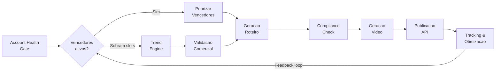

<p align="center">
  
  
  
  
  
  
</p>

<h1 align="center">AIAfiliado</h1>

<p align="center">
  <strong>Plataforma autonoma de video marketing por afiliacao</strong><br>
  Detecta tendencias virais, gera videos com IA e publica automaticamente em TikTok, Instagram e YouTube.
</p>

---

## Como Funciona

O AIAfiliado opera como um **pipeline adaptativo diario** — um motor autonomo que transforma tendencias virais em videos curtos monetizados via afiliacao, sem intervencao manual.



**O ciclo em 6 passos:**

1. **Account Health Gate** — Avalia risco da conta e define quantos posts sao seguros hoje
2. **Priorizacao** — Produtos com vendas comprovadas (vencedores) tem prioridade sobre tendencias novas
3. **Trend Engine** — Coleta tendencias do TikTok Creative Center e Google Trends para preencher slots restantes
4. **Geracao de Conteudo** — LLM gera roteiros com variantes A/B, compliance automatizado e anti-duplicacao
5. **Video + Publicacao** — HeyGen produz videos com avatar realista, publicados via APIs oficiais
6. **Feedback Loop** — Metricas de performance alimentam as decisoes de producao do dia seguinte

---

## Stack Tecnologica

| Camada | Tecnologia |
|---|---|
| **Linguagem** | Python 3.11+ |
| **Orquestracao** | Celery + Redis |
| **Banco de Dados** | PostgreSQL (AWS RDS) |
| **Cloud** | AWS (ECS Fargate, S3, Secrets Manager, CloudWatch, EventBridge) |
| **IaC** | Terraform (14 arquivos, infra completa) |
| **Video** | HeyGen API (avatar realista) |
| **LLM** | GPT-4o-mini / Claude Haiku |
| **Publicacao** | TikTok Content Posting API, Instagram Graph API, YouTube Data API |
| **Afiliados** | TikTok Shop, Hotmart, Monetizze, Amazon Associates, Shopee |
| **CI/CD** | GitHub Actions + Docker |

---

## Arquitetura

```
src/
├── app/                        # Core da aplicacao
│   ├── config.py               # Configuracoes (pydantic-settings + Secrets Manager)
│   ├── celery_app.py           # Celery + Redis (TLS-ready)
│   ├── cloudwatch.py           # Emissao de metricas CloudWatch
│   ├── healthcheck.py          # Health endpoint (DB + Redis + Celery)
│   ├── cli.py                  # CLI para comandos manuais
│   └── logging.py              # Logging estruturado (structlog)
├── models/                     # 7 modelos SQLAlchemy 2.0
│   ├── daily_run.py            # Registro de execucao diaria
│   ├── trend.py                # Tendencias detectadas
│   ├── product.py              # Produtos validados
│   ├── script.py               # Roteiros gerados
│   ├── video.py                # Videos produzidos
│   ├── publication.py          # Publicacoes realizadas
│   └── metric.py               # Metricas coletadas
└── services/                   # 9 servicos (Celery tasks)
    ├── orchestrator.py         # Pipeline diario (coordena tudo)
    ├── account_health.py       # Scoring de risco e limites
    ├── trend_engine.py         # Coleta e ranking de tendencias
    ├── product_service.py      # Validacao comercial de produtos
    ├── script_service.py       # Geracao de roteiros via LLM
    ├── compliance.py           # Validacao de conteudo (blocklist + LLM)
    ├── video_service.py        # Geracao de video (HeyGen)
    ├── publish_service.py      # Publicacao multi-plataforma
    └── analytics_service.py    # Tracking, A/B e feedback loop
```

```
terraform/                      # Infraestrutura AWS completa
├── main.tf                     # Provider e tags globais
├── vpc.tf                      # VPC, subnets, NAT gateway
├── database.tf                 # RDS PostgreSQL
├── redis.tf                    # ElastiCache Redis
├── s3.tf                       # Bucket para videos
├── ecr.tf                      # Container registry
├── ecs.tf                      # ECS Fargate (worker + beat)
├── iam.tf                      # Roles e policies
├── secrets.tf                  # Secrets Manager
├── eventbridge.tf              # Cron scheduling
├── monitoring.tf               # CloudWatch alarmes (13) + log groups (4)
├── variables.tf                # Variaveis configuráveis
├── outputs.tf                  # Outputs uteis
└── backend.tf                  # State remoto (S3)
```

---

## Quick Start

### Pre-requisitos

- Docker e Docker Compose
- Git

### 1. Clonar e configurar

```bash
git clone https://github.com/vinimpm/AIAfiliado.git
cd AIAfiliado

cp .env.example .env
# Editar .env com suas API keys (HeyGen, OpenAI, TikTok, etc.)
```

### 2. Subir o ambiente

```bash
docker compose up -d
```

Isso inicia PostgreSQL, Redis e o worker Celery.

### 3. Rodar migrations

```bash
docker compose exec worker alembic upgrade head
```

### 4. Executar o pipeline manualmente

```bash
docker compose exec worker python -m app.cli trigger_pipeline
```

### 5. Acompanhar logs

```bash
docker compose logs -f worker
```

---

## Testes

```bash
# Criar venv
python -m venv .venv

# Ativar (Windows)
.venv\Scripts\activate

# Ativar (Linux/Mac)
source .venv/bin/activate

# Instalar dependencias
pip install -r requirements.txt

# Rodar testes
PYTHONPATH=src ENV=test pytest tests/ -v
```

**104 testes** cobrindo os servicos principais:

| Modulo | Testes | O que valida |
|---|---|---|
| `test_account_health.py` | 37 | Scoring de risco, decay, classificacao de niveis |
| `test_analytics_service.py` | 15 | Pausa, aposentadoria, A/B winner |
| `test_compliance.py` | 19 | Blocklist, CTA por plataforma, duracao |
| `test_product_service.py` | 15 | Validacao comercial, score, limites semanais |
| `test_script_service.py` | 6 | Hash SHA-256, similaridade coseno, anti-duplicacao |

---

## Deploy (AWS)

### Infraestrutura via Terraform

```bash
cd terraform
terraform init
terraform plan -var="environment=production"
terraform apply -var="environment=production"
```

### CI/CD via GitHub Actions

O workflow `.github/workflows/deploy.yml` automatiza:

1. **Test** — Roda pytest em cada push
2. **Build** — Constroi imagem Docker e publica no ECR
3. **Terraform** — Valida e aplica infraestrutura
4. **Deploy** — Atualiza ECS service e aguarda estabilizacao

### Observabilidade

- **13 alarmes CloudWatch** — Cobertura completa: falhas de pipeline, rejeicoes, timeouts, fila, custos
- **12 metricas custom** — Emitidas pelos servicos em producao
- **4 log groups** — Worker, beat, application, ECS
- **Health check** — Endpoint que valida DB + Redis + Celery

---

## Mecanismos de Seguranca

| Mecanismo | Descricao |
|---|---|
| **Account Health Gate** | Bloqueia pipeline se risco HIGH, ajusta limites dinamicamente |
| **Anti-duplicacao** | SHA-256 hash + similaridade coseno (threshold 0.85) para roteiros |
| **Compliance** | Blocklist de termos proibidos + validacao LLM antes de gerar video |
| **Budget cap** | Limite diario configuravel — pausa pipeline se exceder |
| **Cooldown** | Espaco minimo entre publicacoes baseado no nivel de risco |
| **Secrets** | API keys em AWS Secrets Manager, nunca em codigo |

---

## Documentacao

O diretorio `docs/` contem 14 documentos detalhados cobrindo cada aspecto do sistema:

| # | Documento | Conteudo |
|---|---|---|
| 01 | [PRD](docs/01_PRD.md) | Requisitos, KPIs, escopo e restricoes |
| 02 | [Arquitetura](docs/02_ARQUITETURA.md) | Servicos, pipeline adaptativo e principios |
| 03 | [Dados e Schemas](docs/03_DADOS_E_SCHEMAS.md) | PostgreSQL: 7 tabelas, indices, migrations |
| 04 | [Account Health](docs/04_ACCOUNT_HEALTH_ANTI_BAN.md) | Scoring de risco e recuperacao |
| 05 | [Trend Engine](docs/05_TREND_ENGINE.md) | Coleta e ranking de tendencias |
| 06 | [Produtos](docs/06_PRODUTOS_E_VALIDACAO_COMERCIAL.md) | Validacao comercial e vencedores |
| 07 | [Compliance](docs/07_CONTEUDO_E_POLITICAS.md) | Politicas de conteudo e blocklist |
| 08 | [Roteiros](docs/08_GERACAO_ROTEIRO_E_PROMPTS.md) | Prompts LLM, variantes A/B |
| 09 | [Video](docs/09_AVATAR_E_GERACAO_DE_VIDEO.md) | HeyGen, avatar e custos |
| 10 | [Publicacao](docs/10_PUBLICACAO_E_AGENDAMENTO.md) | APIs oficiais e agendamento |
| 11 | [Tracking](docs/11_TRACKING_E_OTIMIZACAO.md) | Metricas e feedback loop |
| 12 | [Infra & Deploy](docs/12_INFRA_CLOUD_DEPLOY.md) | AWS, Docker, CI/CD |
| 13 | [Observabilidade](docs/13_OBSERVABILIDADE_E_RUNBOOK.md) | Alarmes, logs e runbooks |
| 14 | [Roadmap](docs/14_ROADMAP_E_BACKLOG.md) | 3 fases com backlog detalhado |

---

## Roadmap

| Fase | Foco | Status |
|---|---|---|
| **Fase 1 — MVP** | Pipeline end-to-end com TikTok, Account Health Gate, HeyGen | Codigo completo |
| **Fase 2 — Automacao** | Multi-plataforma (IG/YT), compliance LLM, A/B testing, reaproveitamento de vencedores | Codigo completo |
| **Fase 3 — Escala** | Dashboard, otimizacao de custos, conteudo evergreen, aprendizado continuo | Planejado |

---

## Custos Estimados

| Componente | Custo Mensal (estimado) |
|---|---|
| AWS (ECS + RDS + Redis + S3) | ~R$350-500 |
| HeyGen (plano Creator) | ~R$120-250 |
| OpenAI API (GPT-4o-mini) | ~R$30-60 |
| **Total** | **~R$500-810/mes** |

---

## Licenca

Este projeto e de uso privado.

---

<p align="center">
  <sub>Construido com Python, Celery, Terraform e muita automacao.</sub>
</p>
