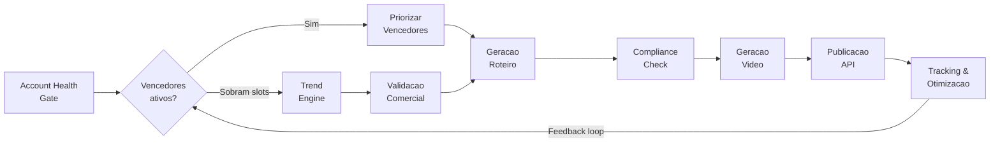

# AIAfiliado — Plataforma Autonoma de Video Marketing por Afiliacao

Plataforma de automacao end-to-end que detecta tendencias virais, seleciona produtos de
afiliacao compatveis, gera roteiros otimizados via LLM, produz videos com avatar realista
(HeyGen) e publica automaticamente em TikTok, Instagram e YouTube — tudo com seguranca
de conta e loop fechado de otimizacao.

O sistema opera como um **pipeline adaptativo diario**: primeiro avalia a saude da conta,
depois prioriza produtos vencedores (que ja geraram vendas), e so entao busca novas
tendencias para preencher slots restantes. O tracking de performance alimenta ativamente
as decisoes de producao do dia seguinte, criando um ciclo de melhoria continua.

---

## Pipeline do Sistema



---

## Stack Tecnologica

| Camada | Tecnologia |
|---|---|
| Linguagem | Python 3.11+ |
| Orquestracao | Celery + Redis |
| Banco de dados | PostgreSQL (AWS RDS) |
| Cloud | AWS (ECS Fargate/EC2, S3, Secrets Manager, CloudWatch, EventBridge) |
| Video | HeyGen API |
| LLM | GPT-4o-mini / Claude Haiku |
| Publicacao | TikTok Content Posting API, Instagram Graph API, YouTube Data API |
| Afiliados | TikTok Shop, Hotmart, Monetizze, Amazon Associates, Shopee |
| CI/CD | GitHub Actions |
| Containerizacao | Docker / Docker Compose |

---

## Indice dos Documentos

| # | Documento | Descricao |
|---|---|---|
| 01 | [01_PRD.md](01_PRD.md) | Requisitos do produto, KPIs, escopo e restricoes |
| 02 | [02_ARQUITETURA.md](02_ARQUITETURA.md) | Servicos, pipeline adaptativo, contratos de API e principios |
| 03 | [03_DADOS_E_SCHEMAS.md](03_DADOS_E_SCHEMAS.md) | Schemas PostgreSQL completos (7 tabelas), indices e migrations |
| 04 | [04_ACCOUNT_HEALTH_ANTI_BAN.md](04_ACCOUNT_HEALTH_ANTI_BAN.md) | Gate de seguranca: scoring de risco, niveis e recuperacao |
| 05 | [05_TREND_ENGINE.md](05_TREND_ENGINE.md) | Coleta de tendencias (TikTok CC, Google Trends) e scoring |
| 06 | [06_PRODUTOS_E_VALIDACAO_COMERCIAL.md](06_PRODUTOS_E_VALIDACAO_COMERCIAL.md) | Integracao com afiliados, validacao e reaproveitamento de vencedores |
| 07 | [07_CONTEUDO_E_POLITICAS.md](07_CONTEUDO_E_POLITICAS.md) | Compliance automatizado via LLM e blocklist |
| 08 | [08_GERACAO_ROTEIRO_E_PROMPTS.md](08_GERACAO_ROTEIRO_E_PROMPTS.md) | Prompts LLM, variantes A/B e anti-duplicacao |
| 09 | [09_AVATAR_E_GERACAO_DE_VIDEO.md](09_AVATAR_E_GERACAO_DE_VIDEO.md) | Integracao HeyGen, avatar, composicao e custos |
| 10 | [10_PUBLICACAO_E_AGENDAMENTO.md](10_PUBLICACAO_E_AGENDAMENTO.md) | APIs oficiais de publicacao, agendamento e retry |
| 11 | [11_TRACKING_E_OTIMIZACAO.md](11_TRACKING_E_OTIMIZACAO.md) | Metricas, loop de otimizacao e feedback fechado |
| 12 | [12_INFRA_CLOUD_DEPLOY.md](12_INFRA_CLOUD_DEPLOY.md) | AWS stack, Docker Compose, CI/CD e custos |
| 13 | [13_OBSERVABILIDADE_E_RUNBOOK.md](13_OBSERVABILIDADE_E_RUNBOOK.md) | Logging, alertas CloudWatch e runbooks de incidente |
| 14 | [14_ROADMAP_E_BACKLOG.md](14_ROADMAP_E_BACKLOG.md) | 3 fases de implementacao com backlog detalhado |

---

## Quick Start (Desenvolvimento Local)

```bash
# 1. Clonar repositorio
git clone https://github.com/seu-usuario/aiafiliado.git
cd aiafiliado

# 2. Configurar variaveis de ambiente
cp .env.example .env
# Editar .env com suas API keys (HeyGen, TikTok, OpenAI, etc.)

# 3. Subir ambiente com Docker Compose
docker compose up -d

# 4. Rodar migrations
docker compose exec worker alembic upgrade head

# 5. Trigger manual do pipeline (para teste)
docker compose exec worker python -m app.cli trigger_pipeline

# 6. Acompanhar logs
docker compose logs -f worker
```

---

## Estrutura de Pastas do Projeto

```
aiafiliado/
├── docs/                          # Documentacao (este diretorio)
│   ├── 00_README.md
│   ├── 01_PRD.md
│   ├── ...
│   └── 14_ROADMAP_E_BACKLOG.md
├── src/
│   ├── app/
│   │   ├── __init__.py
│   │   ├── celery.py              # Configuracao Celery
│   │   ├── config.py              # Configuracoes gerais
│   │   └── cli.py                 # CLI para comandos manuais
│   ├── services/
│   │   ├── account_health.py      # Account Health Gate
│   │   ├── trend_engine.py        # Motor de Tendencias
│   │   ├── product_service.py     # Validacao Comercial
│   │   ├── script_service.py      # Geracao de Roteiros
│   │   ├── compliance.py          # Compliance Check
│   │   ├── video_service.py       # Geracao de Video (HeyGen)
│   │   ├── publish_service.py     # Publicacao via APIs
│   │   └── analytics_service.py   # Tracking e Otimizacao
│   ├── models/                    # SQLAlchemy models
│   │   ├── daily_run.py
│   │   ├── trend.py
│   │   ├── product.py
│   │   ├── script.py
│   │   ├── video.py
│   │   ├── publication.py
│   │   └── metric.py
│   └── orchestrator.py            # Pipeline diario
├── alembic/                       # Migrations
│   ├── alembic.ini
│   ├── env.py
│   └── versions/
├── tests/
│   ├── test_account_health.py
│   ├── test_trend_engine.py
│   └── ...
├── docker-compose.yml
├── Dockerfile
├── requirements.txt
├── .env.example
└── .github/
    └── workflows/
        └── deploy.yml             # CI/CD
```
