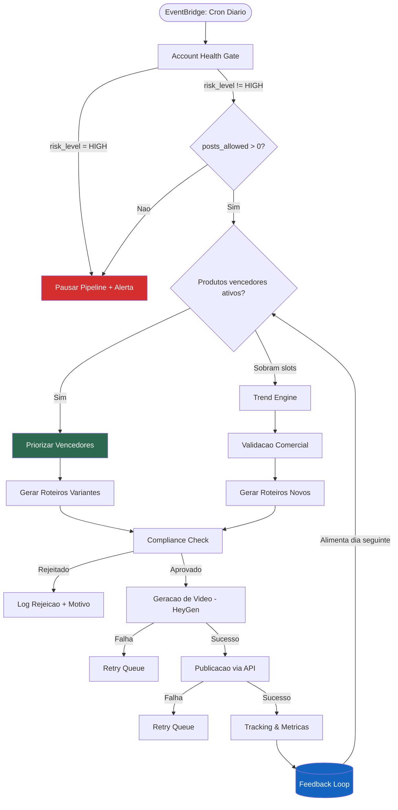
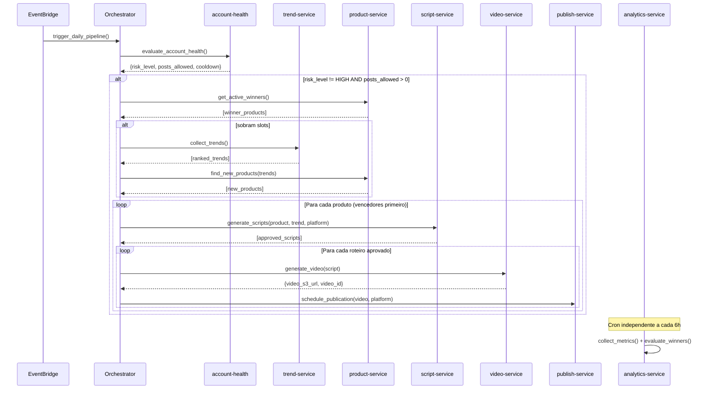
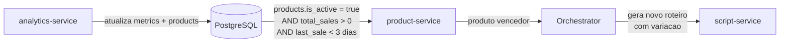

# 02 — Arquitetura do Sistema

> Arquitetura completa da plataforma AIAfiliado: servicos, fluxos de dados,
> comunicacao interna e principios de design.

---

## 1. Diagrama do Pipeline Adaptativo



**Conceito-chave:** O pipeline NAO comeca do zero. A ordem de decisao e:
1. **Account Health Gate** — quantos posts posso fazer hoje?
2. **Avaliar vencedores ativos** — algum link/produto esta performando bem? Priorizar com novos videos
3. **Se sobram slots** — buscar novas tendencias + novos produtos
4. **Gerar roteiros** (variantes para vencedores + novos) → Video → Publicar → Rastrear

O tracking alimenta ativamente a producao do dia seguinte (loop fechado).

---

## 2. Servicos

### 2.1 account-health-service

| Atributo | Valor |
|---|---|
| **Responsabilidade** | Avaliar risco da conta e definir limites diarios |
| **Input** | Metricas coletadas (remocoes, strikes, alcance, cadencia) |
| **Output** | `risk_score`, `risk_level`, `posts_allowed`, `cooldown_minutes` |
| **Dependencias** | PostgreSQL (tabela `daily_runs`), APIs de plataforma |
| **Execucao** | Diario (inicio do pipeline) + pre-publicacao |
| **Doc** | [04_ACCOUNT_HEALTH_ANTI_BAN.md](04_ACCOUNT_HEALTH_ANTI_BAN.md) |

### 2.2 trend-service

| Atributo | Valor |
|---|---|
| **Responsabilidade** | Coletar e ranquear tendencias com potencial comercial |
| **Input** | Dados de TikTok Creative Center, TikTok Shop, Google Trends |
| **Output** | Lista ranqueada de tendencias com score >= 60 |
| **Dependencias** | Redis (cache), PostgreSQL (tabela `trends`) |
| **Execucao** | Diario (apos Account Health Gate, se ha slots disponiveis) |
| **Doc** | [05_TREND_ENGINE.md](05_TREND_ENGINE.md) |

### 2.3 product-service

| Atributo | Valor |
|---|---|
| **Responsabilidade** | Validar produtos, gerenciar links de afiliado, reutilizar vencedores |
| **Input** | Tendencias ranqueadas + dados de performance (via analytics-service) |
| **Output** | Lista de produtos aprovados com affiliate_url e score comercial |
| **Dependencias** | APIs de afiliados (TikTok Shop, Hotmart, Amazon, Shopee), PostgreSQL (tabela `products`) |
| **Execucao** | Diario — primeiro avalia vencedores ativos, depois busca novos |
| **Doc** | [06_PRODUTOS_E_VALIDACAO_COMERCIAL.md](06_PRODUTOS_E_VALIDACAO_COMERCIAL.md) |

### 2.4 script-service

| Atributo | Valor |
|---|---|
| **Responsabilidade** | Gerar roteiros com variantes A/B, validar compliance |
| **Input** | Produto + tendencia + plataforma alvo |
| **Output** | Roteiros aprovados (com hash anti-duplicacao) |
| **Dependencias** | LLM API (GPT-4o/Claude), PostgreSQL (tabelas `scripts`, `trends`) |
| **Execucao** | Sob demanda (chamado pelo orchestrator) |
| **Doc** | [08_GERACAO_ROTEIRO_E_PROMPTS.md](08_GERACAO_ROTEIRO_E_PROMPTS.md), [07_CONTEUDO_E_POLITICAS.md](07_CONTEUDO_E_POLITICAS.md) |

### 2.5 video-service

| Atributo | Valor |
|---|---|
| **Responsabilidade** | Gerar videos via HeyGen API, armazenar em S3 |
| **Input** | Roteiro aprovado + configuracao de avatar |
| **Output** | Video MP4 em S3 com metadados (custo, duracao, hash) |
| **Dependencias** | HeyGen API, AWS S3, PostgreSQL (tabela `videos`) |
| **Execucao** | Sob demanda + webhook de conclusao |
| **Doc** | [09_AVATAR_E_GERACAO_DE_VIDEO.md](09_AVATAR_E_GERACAO_DE_VIDEO.md) |

### 2.6 publish-service

| Atributo | Valor |
|---|---|
| **Responsabilidade** | Publicar videos nas plataformas via APIs oficiais |
| **Input** | Video (S3 URL) + metadados (titulo, descricao, hashtags) + agendamento |
| **Output** | `publication` com external_id e status |
| **Dependencias** | TikTok Content Posting API, Instagram Graph API, YouTube Data API, PostgreSQL (tabela `publications`) |
| **Execucao** | Agendado (respeitando cooldowns e horarios otimos) |
| **Doc** | [10_PUBLICACAO_E_AGENDAMENTO.md](10_PUBLICACAO_E_AGENDAMENTO.md) |

### 2.7 analytics-service

| Atributo | Valor |
|---|---|
| **Responsabilidade** | Coletar metricas, identificar vencedores, alimentar loop de otimizacao |
| **Input** | IDs de publicacoes + APIs de metricas das plataformas |
| **Output** | Metricas atualizadas + sinalizacao de produtos vencedores/pausados |
| **Dependencias** | APIs de plataforma, PostgreSQL (tabelas `metrics`, `products`, `publications`) |
| **Execucao** | Cron a cada 6h por 7 dias apos publicacao |
| **Doc** | [11_TRACKING_E_OTIMIZACAO.md](11_TRACKING_E_OTIMIZACAO.md) |

---

## 3. Comunicacao entre Servicos

### 3.1 Orquestracao via Celery + Redis

Todos os servicos sao implementados como **Celery tasks** orquestradas por um scheduler diario (EventBridge → trigger → orchestrator task).

```
Broker: Redis (ElastiCache)
Backend: Redis (resultados de tasks)
Serializer: JSON
```

### 3.2 Fluxo de Tasks



### 3.3 Contratos de Tasks Celery

```python
# account-health-service
@celery.task
def evaluate_account_health(run_date: str) -> dict:
    """
    Returns:
        {
            "run_id": int,
            "risk_score": float,       # 0-100
            "risk_level": str,         # LOW | MEDIUM | HIGH
            "posts_allowed": int,      # 0-3
            "cooldown_minutes": int,   # 0-240
            "safe_mode": bool
        }
    """

# trend-service
@celery.task
def collect_trends(run_id: int) -> list[dict]:
    """
    Returns: [
        {
            "trend_id": int,
            "name": str,
            "score": float,            # 0-100
            "source": str,             # tiktok_cc | tiktok_shop | google_trends
            "category": str,
            "window_days": int
        }
    ]
    """

# product-service
@celery.task
def get_active_winners() -> list[dict]:
    """
    Returns: [
        {
            "product_id": int,
            "title": str,
            "affiliate_url": str,
            "source_platform": str,
            "total_sales": int,
            "total_revenue": float,
            "last_used_at": str        # ISO datetime
        }
    ]
    """

@celery.task
def find_new_products(trend_ids: list[int]) -> list[dict]:
    """
    Returns: [
        {
            "product_id": int,
            "title": str,
            "price": float,
            "commission": float,
            "affiliate_url": str,
            "source_platform": str,
            "score": float,
            "trend_id": int
        }
    ]
    """

# script-service
@celery.task
def generate_scripts(
    product_id: int,
    trend_id: int | None,
    platform: str,
    variant_count: int = 2
) -> list[dict]:
    """
    Returns: [
        {
            "script_id": int,
            "hook": str,
            "body": str,
            "cta": str,
            "caption": str,
            "hash": str,               # SHA-256
            "variant": str,            # A | B
            "compliance_status": str   # approved | rejected
        }
    ]
    """

# video-service
@celery.task
def generate_video(script_id: int) -> dict:
    """
    Returns:
        {
            "video_id": int,
            "s3_url": str,
            "duration_seconds": float,
            "cost_usd": float,
            "heygen_job_id": str
        }
    """

# publish-service
@celery.task
def schedule_publication(
    video_id: int,
    platform: str,
    scheduled_at: str | None = None
) -> dict:
    """
    Returns:
        {
            "publication_id": int,
            "platform": str,
            "status": str,             # SCHEDULED | UPLOADING | POSTED | FAILED
            "scheduled_at": str,
            "external_id": str | None
        }
    """

# analytics-service
@celery.task
def collect_metrics(publication_id: int) -> dict:
    """
    Returns:
        {
            "publication_id": int,
            "views": int,
            "likes": int,
            "comments": int,
            "shares": int,
            "retention_3s": float,     # 0.0-1.0
            "clicks": int,
            "sales": int,
            "revenue": float
        }
    """
```

---

## 4. Fluxo de Dados End-to-End

```
Tendencia detectada
  → trend-service salva em `trends` (status=active)
  → product-service busca produto compativel
    → salva em `products` (status=validated, is_active=true)
  → script-service gera roteiro
    → valida compliance (LLM)
    → salva em `scripts` (status=approved, hash=SHA256)
  → video-service envia para HeyGen
    → recebe webhook de conclusao
    → upload para S3
    → salva em `videos` (status=ready, s3_url=...)
  → publish-service agenda publicacao
    → respeita cooldown do Account Health Gate
    → publica via API oficial
    → salva em `publications` (status=POSTED, external_id=...)
  → analytics-service coleta metricas (cron 6h)
    → salva em `metrics`
    → avalia: vencedor? pausar? aposentar?
    → atualiza `products.is_active`, `products.total_sales`
  → dia seguinte: product-service le `products` ativos com vendas → prioriza
```

---

## 5. Fluxo de Reaproveitamento de Links Vencedores

O `analytics-service` alimenta diretamente o `product-service` com dados de performance:



**Criterios para reutilizacao:**
- `products.is_active = true`
- `total_sales > 0` nos ultimos 3 dias
- CTR acima da media dos ultimos 7 dias
- Produto nao atingiu limite semanal de videos (configuravel, default: 5/semana)

**Criterios para aposentar:**
- Sem vendas novas ha > 7 dias
- Produto fora de estoque (detectado via API)
- Tendencia associada morreu (score < 30)

---

## 6. Tratamento de Erros e Retry Policy

| Etapa | Tipo de Erro | Retries | Backoff | Fallback |
|---|---|---|---|---|
| Account Health | API indisponivel | 3 | Exponencial (30s, 60s, 120s) | Usar ultimo score conhecido |
| Trend Engine | Scraping falhou | 2 | Linear (60s) | Usar tendencias em cache (< 24h) |
| Product Service | API afiliado offline | 3 | Exponencial (60s, 120s, 300s) | Pular plataforma, usar outras |
| Script Service | LLM timeout | 3 | Exponencial (10s, 30s, 60s) | Tentar modelo fallback |
| Compliance | LLM timeout | 2 | Linear (10s) | Rejeitar roteiro (fail-safe) |
| Video Service | HeyGen falha | 3 | Exponencial (300s, 600s, 1200s) | Fila de espera (retry em 1h) |
| Publish Service | API plataforma falha | 3 | Exponencial (60s, 300s, 600s) | Reagendar para proxima janela |
| Analytics | API metricas falha | 3 | Exponencial (60s, 120s, 300s) | Coletar no proximo ciclo (6h) |

**Politica global:**
- Se 3 retries falham → marcar task como FAILED + alerta
- Tasks FAILED nao bloqueiam o resto do pipeline (fail-safe)
- Todas as tasks sao **idempotentes** — safe to retry

---

## 7. Principios Arquiteturais

| Principio | Descricao |
|---|---|
| **Idempotencia** | Toda task pode ser re-executada sem efeitos colaterais (dedup por hash/ID) |
| **Fail-safe** | Se o Account Health Gate falha, assume HIGH (conservador). Se compliance falha, rejeita roteiro. |
| **Cost-capped** | Limite hard de gasto diario configuravel. Pipeline pausa automaticamente se exceder. |
| **Security-first** | Account Health Gate SEMPRE roda antes de qualquer acao. Nenhum job bypassa o gate. |
| **Loose coupling** | Servicos comunicam via Celery tasks. Cada servico so conhece seu contrato de entrada/saida. |
| **Observable** | Toda task emite logs estruturados (JSON). Metricas de sistema e negocio em CloudWatch. |
| **Pipeline adaptativo** | A producao do dia e influenciada pelos resultados dos dias anteriores (loop fechado). |

---

## Documentos Relacionados

| Documento | Relacao |
|---|---|
| [01_PRD.md](01_PRD.md) | Requisitos que esta arquitetura implementa |
| [03_DADOS_E_SCHEMAS.md](03_DADOS_E_SCHEMAS.md) | Schemas das tabelas referenciadas |
| [04-11](04_ACCOUNT_HEALTH_ANTI_BAN.md) | Detalhamento de cada servico |
| [12_INFRA_CLOUD_DEPLOY.md](12_INFRA_CLOUD_DEPLOY.md) | Infraestrutura AWS que suporta esta arquitetura |
| [13_OBSERVABILIDADE_E_RUNBOOK.md](13_OBSERVABILIDADE_E_RUNBOOK.md) | Monitoramento dos servicos |
