# 03 — Dados e Schemas

> Modelagem completa do banco de dados PostgreSQL da plataforma AIAfiliado:
> tabelas, tipos, constraints, indices e estrategia de migrations.

---

## 1. Diagrama ER

```mermaid
erDiagram
    daily_runs ||--o{ trends : "has"
    daily_runs ||--o{ publications : "has"
    trends ||--o{ products : "associated"
    products ||--o{ scripts : "generates"
    scripts ||--o{ videos : "produces"
    videos ||--o{ publications : "published_as"
    publications ||--o{ metrics : "tracked_by"

    daily_runs {
        int id PK
        date run_date UK
        float risk_score
        varchar risk_level
        int posts_allowed
        int cooldown_minutes
        varchar status
        timestamp started_at
        timestamp finished_at
        jsonb limits_json
    }

    trends {
        int id PK
        int run_id FK
        varchar name
        float score
        int window_days
        varchar source
        varchar category
        varchar platform
        varchar status
        timestamp expires_at
        timestamp created_at
    }

    products {
        int id PK
        varchar source
        varchar source_platform
        varchar title
        float price
        float commission
        varchar affiliate_url
        varchar category
        varchar status
        float score
        boolean is_active
        int total_sales
        float total_revenue
        timestamp validated_at
        timestamp last_used_at
        timestamp created_at
    }

    scripts {
        int id PK
        int product_id FK
        int trend_id FK
        varchar platform
        text hook
        text body
        text cta
        text caption
        varchar hash
        varchar variant
        varchar status
        timestamp created_at
    }

    videos {
        int id PK
        int script_id FK
        varchar provider
        float duration
        varchar s3_url
        varchar hash
        float cost_usd
        varchar status
        varchar heygen_job_id
        timestamp created_at
    }

    publications {
        int id PK
        int video_id FK
        int run_id FK
        varchar platform
        varchar status
        varchar external_id
        timestamp scheduled_at
        timestamp posted_at
        text error_message
    }

    metrics {
        int id PK
        int publication_id FK
        int views
        int likes
        int comments
        int shares
        float retention_3s
        int clicks
        int sales
        float revenue
        timestamp collected_at
    }
```



---

## 2. Schema Completo

### 2.1 `daily_runs`

Registro de cada execucao diaria do pipeline. Armazena o resultado do Account Health Gate e os limites definidos para o dia.

| Coluna | Tipo PostgreSQL | Constraints | Default | Descricao |
|---|---|---|---|---|
| `id` | `SERIAL` | `PRIMARY KEY` | auto | Identificador unico |
| `run_date` | `DATE` | `UNIQUE NOT NULL` | — | Data da execucao (1 por dia) |
| `risk_score` | `NUMERIC(5,2)` | `NOT NULL CHECK (risk_score >= 0 AND risk_score <= 100)` | — | Score de risco calculado (0-100) |
| `risk_level` | `VARCHAR(10)` | `NOT NULL CHECK (risk_level IN ('LOW','MEDIUM','HIGH'))` | — | Nivel de risco derivado do score |
| `posts_allowed` | `INTEGER` | `NOT NULL CHECK (posts_allowed >= 0)` | — | Quantidade maxima de posts permitidos no dia |
| `cooldown_minutes` | `INTEGER` | `NOT NULL CHECK (cooldown_minutes >= 0)` | `0` | Minutos de espera entre publicacoes |
| `status` | `VARCHAR(20)` | `NOT NULL CHECK (status IN ('running','completed','failed','paused'))` | `'running'` | Status da execucao |
| `started_at` | `TIMESTAMP WITH TIME ZONE` | `NOT NULL` | `NOW()` | Inicio da execucao |
| `finished_at` | `TIMESTAMP WITH TIME ZONE` | — | `NULL` | Fim da execucao |
| `limits_json` | `JSONB` | — | `'{}'` | Configuracoes extras do dia (safe_mode, etc.) |

### 2.2 `trends`

Tendencias detectadas a cada dia. Associadas a um `daily_run`.

| Coluna | Tipo PostgreSQL | Constraints | Default | Descricao |
|---|---|---|---|---|
| `id` | `SERIAL` | `PRIMARY KEY` | auto | Identificador unico |
| `run_id` | `INTEGER` | `NOT NULL REFERENCES daily_runs(id) ON DELETE CASCADE` | — | Run que detectou esta tendencia |
| `name` | `VARCHAR(255)` | `NOT NULL` | — | Nome/descricao da tendencia |
| `score` | `NUMERIC(5,2)` | `NOT NULL CHECK (score >= 0 AND score <= 100)` | — | Score composto (crescimento + repetibilidade + comprabilidade + saturacao) |
| `window_days` | `INTEGER` | `NOT NULL CHECK (window_days > 0)` | — | Janela estimada de relevancia (dias) |
| `source` | `VARCHAR(50)` | `NOT NULL CHECK (source IN ('tiktok_cc','tiktok_shop','google_trends'))` | — | Fonte de deteccao |
| `category` | `VARCHAR(100)` | — | `NULL` | Categoria da tendencia (beleza, tech, fitness, etc.) |
| `platform` | `VARCHAR(50)` | — | `NULL` | Plataforma de origem (tiktok, google, etc.) |
| `status` | `VARCHAR(20)` | `NOT NULL CHECK (status IN ('active','expired','discarded'))` | `'active'` | Status atual |
| `expires_at` | `TIMESTAMP WITH TIME ZONE` | — | `NULL` | Data estimada de expiracao |
| `created_at` | `TIMESTAMP WITH TIME ZONE` | `NOT NULL` | `NOW()` | Data de criacao |

### 2.3 `products`

Produtos validados para afiliacao. Suportam reaproveitamento de links vencedores.

| Coluna | Tipo PostgreSQL | Constraints | Default | Descricao |
|---|---|---|---|---|
| `id` | `SERIAL` | `PRIMARY KEY` | auto | Identificador unico |
| `source` | `VARCHAR(100)` | `NOT NULL` | — | Identificador do produto na plataforma de origem |
| `source_platform` | `VARCHAR(50)` | `NOT NULL CHECK (source_platform IN ('tiktok_shop','hotmart','monetizze','amazon','shopee'))` | — | Plataforma de afiliacao |
| `title` | `VARCHAR(500)` | `NOT NULL` | — | Nome do produto |
| `price` | `NUMERIC(10,2)` | `NOT NULL CHECK (price > 0)` | — | Preco do produto (R$) |
| `commission` | `NUMERIC(10,2)` | `NOT NULL CHECK (commission > 0)` | — | Valor da comissao (R$ ou %) |
| `affiliate_url` | `TEXT` | `NOT NULL` | — | Link de afiliado |
| `category` | `VARCHAR(100)` | — | `NULL` | Categoria do produto |
| `status` | `VARCHAR(20)` | `NOT NULL CHECK (status IN ('pending','validated','rejected','retired'))` | `'pending'` | Status de validacao |
| `score` | `NUMERIC(5,2)` | `CHECK (score >= 0 AND score <= 100)` | `NULL` | Score comercial |
| `is_active` | `BOOLEAN` | `NOT NULL` | `FALSE` | Se o produto esta ativo para geracao de conteudo |
| `total_sales` | `INTEGER` | `NOT NULL` | `0` | Total de vendas acumuladas |
| `total_revenue` | `NUMERIC(10,2)` | `NOT NULL` | `0.00` | Receita total acumulada (R$) |
| `validated_at` | `TIMESTAMP WITH TIME ZONE` | — | `NULL` | Data de validacao |
| `last_used_at` | `TIMESTAMP WITH TIME ZONE` | — | `NULL` | Ultima vez que foi usado em video |
| `created_at` | `TIMESTAMP WITH TIME ZONE` | `NOT NULL` | `NOW()` | Data de criacao |

### 2.4 `scripts`

Roteiros gerados para videos. Suportam variantes A/B e anti-duplicacao via hash.

| Coluna | Tipo PostgreSQL | Constraints | Default | Descricao |
|---|---|---|---|---|
| `id` | `SERIAL` | `PRIMARY KEY` | auto | Identificador unico |
| `product_id` | `INTEGER` | `NOT NULL REFERENCES products(id) ON DELETE CASCADE` | — | Produto associado |
| `trend_id` | `INTEGER` | `REFERENCES trends(id) ON DELETE SET NULL` | `NULL` | Tendencia associada (pode ser NULL para vencedores reutilizados) |
| `platform` | `VARCHAR(50)` | `NOT NULL CHECK (platform IN ('tiktok','instagram','youtube'))` | — | Plataforma alvo |
| `hook` | `TEXT` | `NOT NULL` | — | Texto do hook (0-3s) |
| `body` | `TEXT` | `NOT NULL` | — | Corpo do roteiro (problema + demonstracao + prova) |
| `cta` | `TEXT` | `NOT NULL` | — | Call-to-action |
| `caption` | `TEXT` | — | `NULL` | Legenda/descricao para a plataforma |
| `hash` | `VARCHAR(64)` | `UNIQUE NOT NULL` | — | SHA-256 do texto normalizado (anti-duplicacao) |
| `variant` | `VARCHAR(5)` | `NOT NULL CHECK (variant IN ('A','B'))` | — | Variante A/B |
| `status` | `VARCHAR(20)` | `NOT NULL CHECK (status IN ('draft','approved','rejected','used'))` | `'draft'` | Status do roteiro |
| `created_at` | `TIMESTAMP WITH TIME ZONE` | `NOT NULL` | `NOW()` | Data de criacao |

### 2.5 `videos`

Videos gerados via HeyGen. Armazenados no S3.

| Coluna | Tipo PostgreSQL | Constraints | Default | Descricao |
|---|---|---|---|---|
| `id` | `SERIAL` | `PRIMARY KEY` | auto | Identificador unico |
| `script_id` | `INTEGER` | `NOT NULL REFERENCES scripts(id) ON DELETE CASCADE` | — | Roteiro usado |
| `provider` | `VARCHAR(50)` | `NOT NULL` | `'heygen'` | Provedor de geracao de video |
| `duration` | `NUMERIC(6,2)` | `CHECK (duration > 0)` | `NULL` | Duracao em segundos |
| `s3_url` | `TEXT` | — | `NULL` | URL do video no S3 |
| `hash` | `VARCHAR(64)` | `UNIQUE` | `NULL` | Hash do video (anti-duplicacao) |
| `cost_usd` | `NUMERIC(8,4)` | `CHECK (cost_usd >= 0)` | `NULL` | Custo de geracao em USD |
| `status` | `VARCHAR(20)` | `NOT NULL CHECK (status IN ('pending','generating','ready','failed'))` | `'pending'` | Status do video |
| `heygen_job_id` | `VARCHAR(100)` | — | `NULL` | ID do job no HeyGen |
| `created_at` | `TIMESTAMP WITH TIME ZONE` | `NOT NULL` | `NOW()` | Data de criacao |

### 2.6 `publications`

Publicacoes de videos nas plataformas. Rastreiam status de upload e agendamento.

| Coluna | Tipo PostgreSQL | Constraints | Default | Descricao |
|---|---|---|---|---|
| `id` | `SERIAL` | `PRIMARY KEY` | auto | Identificador unico |
| `video_id` | `INTEGER` | `NOT NULL REFERENCES videos(id) ON DELETE CASCADE` | — | Video publicado |
| `run_id` | `INTEGER` | `REFERENCES daily_runs(id) ON DELETE SET NULL` | `NULL` | Run que originou esta publicacao |
| `platform` | `VARCHAR(50)` | `NOT NULL CHECK (platform IN ('tiktok','instagram','youtube'))` | — | Plataforma de publicacao |
| `status` | `VARCHAR(20)` | `NOT NULL CHECK (status IN ('SCHEDULED','UPLOADING','POSTED','FAILED'))` | `'SCHEDULED'` | Status da publicacao |
| `external_id` | `VARCHAR(200)` | — | `NULL` | ID do post na plataforma |
| `scheduled_at` | `TIMESTAMP WITH TIME ZONE` | — | `NULL` | Horario agendado |
| `posted_at` | `TIMESTAMP WITH TIME ZONE` | — | `NULL` | Horario efetivo da publicacao |
| `error_message` | `TEXT` | — | `NULL` | Mensagem de erro (se FAILED) |

### 2.7 `metrics` (NOVA)

Metricas de performance coletadas periodicamente para cada publicacao.

| Coluna | Tipo PostgreSQL | Constraints | Default | Descricao |
|---|---|---|---|---|
| `id` | `SERIAL` | `PRIMARY KEY` | auto | Identificador unico |
| `publication_id` | `INTEGER` | `NOT NULL REFERENCES publications(id) ON DELETE CASCADE` | — | Publicacao rastreada |
| `views` | `INTEGER` | `NOT NULL CHECK (views >= 0)` | `0` | Numero de visualizacoes |
| `likes` | `INTEGER` | `NOT NULL CHECK (likes >= 0)` | `0` | Numero de likes |
| `comments` | `INTEGER` | `NOT NULL CHECK (comments >= 0)` | `0` | Numero de comentarios |
| `shares` | `INTEGER` | `NOT NULL CHECK (shares >= 0)` | `0` | Numero de compartilhamentos |
| `retention_3s` | `NUMERIC(5,4)` | `CHECK (retention_3s >= 0 AND retention_3s <= 1)` | `NULL` | Taxa de retencao em 3 segundos (0.0-1.0) |
| `clicks` | `INTEGER` | `NOT NULL CHECK (clicks >= 0)` | `0` | Clicks no link de afiliado |
| `sales` | `INTEGER` | `NOT NULL CHECK (sales >= 0)` | `0` | Vendas atribuidas |
| `revenue` | `NUMERIC(10,2)` | `NOT NULL CHECK (revenue >= 0)` | `0.00` | Receita gerada (R$) |
| `collected_at` | `TIMESTAMP WITH TIME ZONE` | `NOT NULL` | `NOW()` | Momento da coleta |

---

## 3. Indices Recomendados

```sql
-- daily_runs
CREATE UNIQUE INDEX idx_daily_runs_date ON daily_runs(run_date);
CREATE INDEX idx_daily_runs_status ON daily_runs(status);

-- trends
CREATE INDEX idx_trends_run_id ON trends(run_id);
CREATE INDEX idx_trends_status ON trends(status);
CREATE INDEX idx_trends_score ON trends(score DESC);
CREATE INDEX idx_trends_source ON trends(source);
CREATE INDEX idx_trends_created_at ON trends(created_at DESC);

-- products
CREATE INDEX idx_products_source_platform ON products(source_platform);
CREATE INDEX idx_products_status ON products(status);
CREATE INDEX idx_products_is_active ON products(is_active) WHERE is_active = TRUE;
CREATE INDEX idx_products_score ON products(score DESC NULLS LAST);
CREATE INDEX idx_products_total_sales ON products(total_sales DESC);
CREATE INDEX idx_products_last_used_at ON products(last_used_at DESC NULLS LAST);
CREATE INDEX idx_products_active_winners ON products(is_active, total_sales DESC)
    WHERE is_active = TRUE AND total_sales > 0;

-- scripts
CREATE UNIQUE INDEX idx_scripts_hash ON scripts(hash);
CREATE INDEX idx_scripts_product_id ON scripts(product_id);
CREATE INDEX idx_scripts_trend_id ON scripts(trend_id);
CREATE INDEX idx_scripts_status ON scripts(status);
CREATE INDEX idx_scripts_variant ON scripts(variant);

-- videos
CREATE UNIQUE INDEX idx_videos_hash ON videos(hash) WHERE hash IS NOT NULL;
CREATE INDEX idx_videos_script_id ON videos(script_id);
CREATE INDEX idx_videos_status ON videos(status);
CREATE INDEX idx_videos_heygen_job_id ON videos(heygen_job_id) WHERE heygen_job_id IS NOT NULL;

-- publications
CREATE INDEX idx_publications_video_id ON publications(video_id);
CREATE INDEX idx_publications_run_id ON publications(run_id);
CREATE INDEX idx_publications_platform ON publications(platform);
CREATE INDEX idx_publications_status ON publications(status);
CREATE INDEX idx_publications_scheduled_at ON publications(scheduled_at);
CREATE INDEX idx_publications_posted_at ON publications(posted_at DESC NULLS LAST);
CREATE INDEX idx_publications_external_id ON publications(external_id)
    WHERE external_id IS NOT NULL;

-- metrics
CREATE INDEX idx_metrics_publication_id ON metrics(publication_id);
CREATE INDEX idx_metrics_collected_at ON metrics(collected_at DESC);
CREATE INDEX idx_metrics_pub_collected ON metrics(publication_id, collected_at DESC);
```

---

## 4. Estrategia de Migrations (Alembic)

### 4.1 Configuracao

```
projeto/
├── alembic/
│   ├── alembic.ini
│   ├── env.py
│   └── versions/
│       ├── 001_create_daily_runs.py
│       ├── 002_create_trends.py
│       ├── 003_create_products.py
│       ├── 004_create_scripts.py
│       ├── 005_create_videos.py
│       ├── 006_create_publications.py
│       └── 007_create_metrics.py
```

### 4.2 Regras de Migration

| Regra | Descricao |
|---|---|
| **Numeracao sequencial** | Prefixo numerico (001, 002, ...) para garantir ordem |
| **Uma tabela por migration** | Facilita rollback granular |
| **Sempre com downgrade** | Todo `upgrade()` tem um `downgrade()` correspondente |
| **Sem dados em migration** | Seeds e fixtures separados |
| **Review antes de apply** | `alembic upgrade --sql` para revisar SQL gerado |

### 4.3 Workflow

```bash
# Criar nova migration
alembic revision --autogenerate -m "create_metrics_table"

# Revisar SQL gerado
alembic upgrade head --sql

# Aplicar
alembic upgrade head

# Rollback
alembic downgrade -1
```

### 4.4 Convencoes de Naming

| Elemento | Convencao | Exemplo |
|---|---|---|
| Tabelas | snake_case, plural | `daily_runs`, `products` |
| Colunas | snake_case | `risk_score`, `created_at` |
| PKs | `id` (SERIAL) | `id` |
| FKs | `{tabela_singular}_id` | `product_id`, `run_id` |
| Indices | `idx_{tabela}_{colunas}` | `idx_products_is_active` |
| Constraints | `chk_{tabela}_{coluna}` | `chk_daily_runs_risk_level` |
| Unique | `uq_{tabela}_{coluna}` | `uq_scripts_hash` |

---

## 5. Queries Importantes

### 5.1 Buscar produtos vencedores ativos

```sql
SELECT p.id, p.title, p.affiliate_url, p.source_platform,
       p.total_sales, p.total_revenue, p.last_used_at
FROM products p
WHERE p.is_active = TRUE
  AND p.status = 'validated'
  AND p.total_sales > 0
  AND EXISTS (
      SELECT 1 FROM metrics m
      JOIN publications pub ON pub.id = m.publication_id
      JOIN videos v ON v.id = pub.video_id
      JOIN scripts s ON s.id = v.script_id
      WHERE s.product_id = p.id
        AND m.sales > 0
        AND m.collected_at > NOW() - INTERVAL '3 days'
  )
ORDER BY p.total_sales DESC;
```

### 5.2 Verificar limite semanal de videos por produto

```sql
SELECT COUNT(*) as videos_this_week
FROM scripts s
WHERE s.product_id = :product_id
  AND s.status IN ('approved', 'used')
  AND s.created_at > NOW() - INTERVAL '7 days';
```

### 5.3 Metricas mais recentes de uma publicacao

```sql
SELECT * FROM metrics
WHERE publication_id = :publication_id
ORDER BY collected_at DESC
LIMIT 1;
```

### 5.4 Produtos para aposentar

```sql
SELECT p.id, p.title, p.last_used_at
FROM products p
WHERE p.is_active = TRUE
  AND NOT EXISTS (
      SELECT 1 FROM metrics m
      JOIN publications pub ON pub.id = m.publication_id
      JOIN videos v ON v.id = pub.video_id
      JOIN scripts s ON s.id = v.script_id
      WHERE s.product_id = p.id
        AND m.sales > 0
        AND m.collected_at > NOW() - INTERVAL '7 days'
  );
```

---

## Documentos Relacionados

| Documento | Relacao |
|---|---|
| [02_ARQUITETURA.md](02_ARQUITETURA.md) | Servicos que usam estas tabelas |
| [04_ACCOUNT_HEALTH_ANTI_BAN.md](04_ACCOUNT_HEALTH_ANTI_BAN.md) | Usa `daily_runs` |
| [05_TREND_ENGINE.md](05_TREND_ENGINE.md) | Usa `trends` |
| [06_PRODUTOS_E_VALIDACAO_COMERCIAL.md](06_PRODUTOS_E_VALIDACAO_COMERCIAL.md) | Usa `products` |
| [08_GERACAO_ROTEIRO_E_PROMPTS.md](08_GERACAO_ROTEIRO_E_PROMPTS.md) | Usa `scripts` |
| [09_AVATAR_E_GERACAO_DE_VIDEO.md](09_AVATAR_E_GERACAO_DE_VIDEO.md) | Usa `videos` |
| [10_PUBLICACAO_E_AGENDAMENTO.md](10_PUBLICACAO_E_AGENDAMENTO.md) | Usa `publications` |
| [11_TRACKING_E_OTIMIZACAO.md](11_TRACKING_E_OTIMIZACAO.md) | Usa `metrics` |
