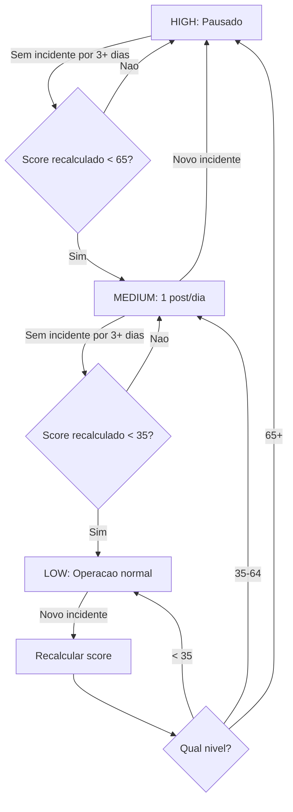

# 04 — Account Health & Anti-Ban Gate

> Sistema de seguranca que avalia o risco da conta antes de qualquer acao,
> definindo limites diarios e protegendo contra banimento.

---

## 1. Objetivo

O Account Health Gate e a **primeira etapa** de todo pipeline diario. Nenhum conteudo
e gerado, nenhum video e publicado sem antes passar por esta avaliacao.

**Funcoes:**
- Calcular um score de risco (0-100) baseado em sinais da conta
- Definir quantos posts podem ser feitos no dia
- Impor cooldowns entre publicacoes
- Ativar safe mode quando necessario
- Bloquear pipeline quando risco e critico

**Execucao:**
- **Diaria:** Inicio do pipeline (via EventBridge cron)
- **Pre-publicacao:** Re-verificacao antes de cada post (via publish-service)

---

## 2. Fontes de Sinais

| Sinal | Como Coletar | Fonte | Frequencia |
|---|---|---|---|
| Videos removidos | TikTok Content API — listar videos, verificar status `removed` | API oficial | Diario |
| Avisos/strikes | TikTok Creator API — verificar violations | API oficial | Diario |
| Queda de alcance | Comparar media de views dos ultimos 7 videos vs. media historica (30d) | Tabela `metrics` | Diario |
| Similaridade de conteudo | Calcular similaridade coseno entre os ultimos 5 roteiros publicados | Tabela `scripts` | Diario |
| Cadencia de posts | Contar publicacoes nos ultimos 7 dias | Tabela `publications` | Diario |

### Detalhamento da coleta:

**Videos removidos:**
```python
# Verificar status dos ultimos 30 videos publicados
removed_count = count(
    publications
    WHERE platform = 'tiktok'
    AND posted_at > NOW() - INTERVAL '30 days'
    AND status = 'REMOVED'  # detectado via API
)
removal_rate = removed_count / total_recent_posts
```

**Queda de alcance:**
```python
avg_views_7d = AVG(metrics.views) dos ultimos 7 videos
avg_views_30d = AVG(metrics.views) dos ultimos 30 videos
drop_ratio = 1 - (avg_views_7d / avg_views_30d)  # positivo = queda
```

**Similaridade de conteudo:**
```python
from sklearn.metrics.pairwise import cosine_similarity
from sklearn.feature_extraction.text import TfidfVectorizer

recent_scripts = ultimos 5 roteiros publicados
vectorizer = TfidfVectorizer()
tfidf = vectorizer.fit_transform([s.hook + s.body + s.cta for s in recent_scripts])
avg_similarity = mean(cosine_similarity(tfidf)  # excluindo diagonal)
```

---

## 3. Algoritmo de Scoring

### 3.1 Formula

```
risk_score = (
    W_remocoes   * score_remocoes   +
    W_avisos     * score_avisos     +
    W_alcance    * score_alcance    +
    W_similar    * score_similar    +
    W_cadencia   * score_cadencia
)
```

### 3.2 Tabela de Pesos

| Componente | Peso (W) | Range do Score | Contribuicao Max |
|---|---|---|---|
| Remocoes | 0.35 | 0-100 | 35 pontos |
| Avisos/Strikes | 0.25 | 0-100 | 25 pontos |
| Queda de alcance | 0.15 | 0-100 | 15 pontos |
| Similaridade de conteudo | 0.15 | 0-100 | 15 pontos |
| Cadencia excessiva | 0.10 | 0-100 | 10 pontos |
| **Total** | **1.00** | | **100 pontos** |

### 3.3 Calculo de Cada Componente

**Remocoes (0-100):**
```python
if removal_count == 0:   score = 0
elif removal_count == 1: score = 40
elif removal_count == 2: score = 70
else:                    score = 100
```

**Avisos/Strikes (0-100):**
```python
if strike_count == 0:    score = 0
elif strike_count == 1:  score = 60
else:                    score = 100
```

**Queda de alcance (0-100):**
```python
if drop_ratio <= 0:      score = 0    # sem queda ou crescimento
elif drop_ratio <= 0.3:  score = 30   # queda leve
elif drop_ratio <= 0.5:  score = 60   # queda moderada
else:                    score = 100  # queda severa
```

**Similaridade (0-100):**
```python
if avg_similarity <= 0.5:  score = 0
elif avg_similarity <= 0.7: score = 40
elif avg_similarity <= 0.85: score = 70
else:                       score = 100
```

**Cadencia (0-100):**
```python
posts_7d = count(publications dos ultimos 7 dias)
if posts_7d <= 7:    score = 0    # <= 1/dia
elif posts_7d <= 14: score = 30   # <= 2/dia
elif posts_7d <= 21: score = 60   # <= 3/dia
else:                score = 100  # > 3/dia
```

---

## 4. Niveis e Acoes Automaticas

| Nivel | Range | Posts/dia | Cooldown | Acoes |
|---|---|---|---|---|
| **LOW** | 0-34 | Max 3 | 2 horas | Operacao normal. Pipeline completo. |
| **MEDIUM** | 35-64 | Max 1 | 4 horas | Reduzir volume. Variar formato/estilo. Alertar operador. |
| **HIGH** | 65-100 | 0 | N/A | **Pausar todas as publicacoes.** Ativar safe mode. Alerta critico. |

### Detalhamento das acoes:

**LOW (0-34) — Operacao Normal:**
- Pipeline executa completamente
- Ate 3 posts por dia (respeitando cooldown de 2h entre eles)
- Priorizar vencedores + buscar novas tendencias
- Sem restricoes adicionais

**MEDIUM (35-64) — Modo Cauteloso:**
- Apenas 1 post por dia
- Cooldown de 4 horas entre a avaliacao e o post
- Forcar diversificacao: variar hook style, CTA, layout visual
- Priorizar apenas produtos vencedores (nao buscar novos)
- Enviar alerta ao operador via CloudWatch + log

**HIGH (65-100) — Modo Seguro:**
- Zero publicacoes — pipeline pausa
- `safe_mode = true` no `limits_json`
- Alerta critico imediato
- Aguardar decay natural do score
- Somente re-executar pipeline manualmente apos revisao

---

## 5. Decay de Score (Reducao com o Tempo)

O risco diminui naturalmente se nenhum novo incidente ocorrer.

### Formula de Decay

```python
days_since_incident = (today - last_incident_date).days
decay_factor = max(0, 1 - (days_since_incident * 0.1))  # 10% por dia
adjusted_component_score = original_score * decay_factor
```

| Dias sem incidente | Decay Factor | Efeito |
|---|---|---|
| 0 | 1.00 | Score original |
| 1 | 0.90 | -10% |
| 3 | 0.70 | -30% |
| 5 | 0.50 | -50% |
| 7 | 0.30 | -70% |
| 10+ | 0.00 | Componente zerado |

**Importante:** O decay se aplica **por componente**, nao no score total. Uma remocao de video ha 5 dias contribui com 50% do seu peso original.

---

## 6. Fluxo de Recuperacao



**Tempo tipico de recuperacao:**
- HIGH → MEDIUM: ~3-5 dias sem incidentes
- MEDIUM → LOW: ~3-5 dias adicionais
- HIGH → LOW: ~7-10 dias total

---

## 7. Exemplo de Calculo Completo

### Cenario: Conta com 1 video removido ha 2 dias, alcance estavel, conteudo levemente similar

| Componente | Valor Raw | Score Raw | Decay | Score Ajustado | Peso | Contribuicao |
|---|---|---|---|---|---|---|
| Remocoes | 1 remocao (2 dias atras) | 40 | 0.80 | 32.0 | 0.35 | **11.2** |
| Avisos | 0 strikes | 0 | — | 0 | 0.25 | **0.0** |
| Alcance | drop_ratio = 0.10 | 0 | — | 0 | 0.15 | **0.0** |
| Similaridade | avg = 0.65 | 40 | — | 40.0 | 0.15 | **6.0** |
| Cadencia | 10 posts em 7d | 30 | — | 30.0 | 0.10 | **3.0** |
| | | | | | **Total** | **20.2** |

**Resultado:** risk_score = 20.2 → **LOW** → 3 posts/dia permitidos, cooldown 2h

### Se no dia seguinte outro video fosse removido:

| Componente | Score Ajustado | Peso | Contribuicao |
|---|---|---|---|
| Remocoes | 70 (2 remocoes, 1 recente) | 0.35 | **24.5** |
| Avisos | 0 | 0.25 | **0.0** |
| Alcance | 0 | 0.15 | **0.0** |
| Similaridade | 40 | 0.15 | **6.0** |
| Cadencia | 30 | 0.10 | **3.0** |
| | | **Total** | **33.5** |

**Resultado:** risk_score = 33.5 → Ainda **LOW**, mas proximo do limite. Um terceiro incidente levaria a MEDIUM.

---

## 8. Saida do Account Health Gate

```python
{
    "run_id": 42,
    "run_date": "2025-03-15",
    "risk_score": 20.2,
    "risk_level": "LOW",
    "posts_allowed": 3,
    "cooldown_minutes": 120,
    "safe_mode": False,
    "components": {
        "removals": {"raw": 40, "decayed": 32.0, "weighted": 11.2},
        "strikes": {"raw": 0, "decayed": 0, "weighted": 0.0},
        "reach_drop": {"raw": 0, "decayed": 0, "weighted": 0.0},
        "similarity": {"raw": 40, "decayed": 40.0, "weighted": 6.0},
        "cadence": {"raw": 30, "decayed": 30.0, "weighted": 3.0}
    }
}
```

Salvo na tabela `daily_runs` (ver [03_DADOS_E_SCHEMAS.md](03_DADOS_E_SCHEMAS.md#21-daily_runs)).

---

## Documentos Relacionados

| Documento | Relacao |
|---|---|
| [01_PRD.md](01_PRD.md) | RF-001, RF-017 — requisitos que este modulo implementa |
| [02_ARQUITETURA.md](02_ARQUITETURA.md) | Posicao no pipeline e contrato de task |
| [03_DADOS_E_SCHEMAS.md](03_DADOS_E_SCHEMAS.md) | Tabela `daily_runs` |
| [10_PUBLICACAO_E_AGENDAMENTO.md](10_PUBLICACAO_E_AGENDAMENTO.md) | Consome posts_allowed e cooldown |
| [13_OBSERVABILIDADE_E_RUNBOOK.md](13_OBSERVABILIDADE_E_RUNBOOK.md) | Alertas de HIGH risk |
