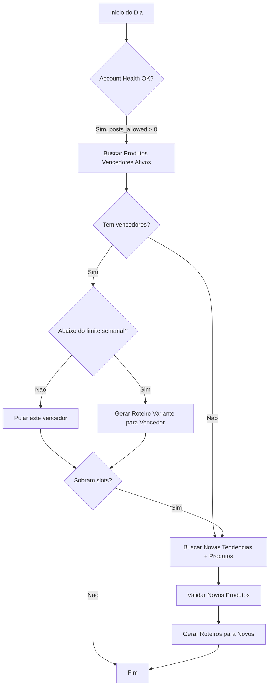

# 06 — Produtos e Validacao Comercial

> Sistema de integracao com plataformas de afiliados, validacao de produtos
> e reaproveitamento de links vencedores.

---

## 1. Integracao por Plataforma

### 1.1 TikTok Shop Affiliate

| Atributo | Valor |
|---|---|
| **API** | TikTok Shop Open API (Affiliate module) |
| **Autenticacao** | App Key + App Secret + Access Token |
| **Como obter links** | Endpoint de geracao de link de afiliado por produto |
| **Comissoes tipicas** | 5-20% (definida pelo vendedor) |
| **Categorias fortes** | Beleza, moda, acessorios, casa, tech acessorios |
| **Vantagem** | Link nativo na plataforma → melhor conversao |
| **Rate limit** | Conforme documentacao oficial |

**Fluxo:**
1. Buscar produtos trending no TikTok Shop (por categoria ou keyword)
2. Filtrar por comissao minima e avaliacao
3. Gerar link de afiliado via API
4. Salvar em `products` com `source_platform = 'tiktok_shop'`

### 1.2 Hotmart / Monetizze (Produtos Digitais)

| Atributo | Valor |
|---|---|
| **API** | Hotmart API v2 / Monetizze API |
| **Autenticacao** | OAuth 2.0 (Hotmart) / API Key (Monetizze) |
| **Como obter links** | Endpoint de afiliacao por produto |
| **Comissao minima** | R$10 ou 30%+ (infoprodutos tem comissoes altas) |
| **Categorias fortes** | Saude, emagrecimento, renda extra, educacao |
| **Filtros** | Temperatura (Hotmart), Blueprint score, avaliacao |

**Fluxo:**
1. Buscar produtos no marketplace por categoria ou keyword
2. Filtrar por: temperatura > 50 (Hotmart), comissao > R$10, avaliacao >= 4.3
3. Gerar link de afiliado via API
4. Salvar com `source_platform = 'hotmart'` ou `'monetizze'`

### 1.3 Amazon Associates BR (Product Advertising API)

| Atributo | Valor |
|---|---|
| **API** | Product Advertising API 5.0 |
| **Autenticacao** | Access Key + Secret Key + Associate Tag |
| **Como obter links** | SearchItems → gerar URL com tag de afiliado |
| **Comissoes tipicas** | 1-10% (por categoria) |
| **Categorias fortes** | Eletronicos, casa, beleza, livros |
| **Restricoes** | Nao mencionar precos diretamente (politica Amazon) |
| **Rate limit** | 1 request/segundo (padrao) |

**Fluxo:**
1. Buscar produtos por keyword (relacionada a tendencia)
2. Filtrar por: preco R$30-150, avaliacao >= 4.3, disponivel
3. Construir URL com tag de afiliado
4. Salvar com `source_platform = 'amazon'`

### 1.4 Shopee Affiliate

| Atributo | Valor |
|---|---|
| **API** | Shopee Affiliate Platform API |
| **Autenticacao** | API Key + Secret via portal de afiliados |
| **Como obter links** | Gerar deep link ou link de afiliado via API |
| **Comissoes tipicas** | 3-15% |
| **Categorias fortes** | Moda, beleza, casa, eletronicos acessiveis |
| **Vantagem** | Precos agressivos, frete gratis frequente |

**Fluxo:**
1. Buscar produtos populares por categoria
2. Filtrar por comissao e avaliacao
3. Gerar link de afiliado
4. Salvar com `source_platform = 'shopee'`

---

## 2. Criterios de Validacao (Score Comercial)

### 2.1 Criterios Obrigatorios (elimina se falhar)

| Criterio | Regra | Configuravel |
|---|---|---|
| Comissao minima | >= R$5 ou >= 10% (o que for maior) | Sim (`MIN_COMMISSION_BRL`, `MIN_COMMISSION_PCT`) |
| Avaliacao minima | >= 4.3 estrelas | Sim (`MIN_RATING`) |
| Preco de impulso | R$30-150 (fisico) / ate R$297 (digital) | Sim (`PRICE_RANGE_PHYSICAL`, `PRICE_RANGE_DIGITAL`) |
| Categoria permitida | Dentro da whitelist | Sim (`ALLOWED_CATEGORIES`) |
| Disponibilidade | Produto em estoque / disponivel | Nao |

### 2.2 Score Comercial (0-100)

```python
score = (
    comissao_score    * 0.35 +
    avaliacao_score   * 0.20 +
    preco_score       * 0.20 +
    relevancia_score  * 0.25
)
```

**Comissao (35%):**
```python
if commission_pct >= 30:  comissao_score = 100  # otimo (digital)
elif commission_pct >= 20: comissao_score = 80
elif commission_pct >= 10: comissao_score = 60
elif commission_pct >= 5:  comissao_score = 40
else:                      comissao_score = 0   # abaixo do minimo
```

**Avaliacao (20%):**
```python
if rating >= 4.8:   avaliacao_score = 100
elif rating >= 4.5: avaliacao_score = 80
elif rating >= 4.3: avaliacao_score = 60
else:               avaliacao_score = 0  # abaixo do minimo
```

**Preco (20%):**
```python
# "Sweet spot" de preco de impulso
if 50 <= price <= 100:    preco_score = 100  # faixa ideal
elif 30 <= price <= 150:  preco_score = 70
elif 150 < price <= 297:  preco_score = 40   # so digital
else:                     preco_score = 0
```

**Relevancia com tendencia (25%):**
```python
# Similaridade semantica entre nome do produto e tendencia
relevancia_score = cosine_similarity(
    embed(product.title + product.category),
    embed(trend.name + trend.category)
) * 100
```

---

## 3. Reaproveitamento de Links Vencedores

### 3.1 Criterios para Considerar um Link "Vencedor"

Um produto e considerado **vencedor** quando:

```python
is_winner = (
    product.is_active == True
    AND product.total_sales > 0
    AND has_sale_in_last_3_days(product)
    AND avg_ctr(product) > global_avg_ctr
)
```

| Criterio | Condicao | Justificativa |
|---|---|---|
| Ativo | `is_active = TRUE` | Produto nao foi aposentado |
| Vendas recentes | Pelo menos 1 venda nos ultimos 3 dias | Demanda ainda existe |
| CTR acima da media | CTR do produto > media global dos ultimos 7 dias | Engajamento superior |

### 3.2 Fluxo Diario de Reaproveitamento



**Ordem de priorizacao:**
1. Produtos vencedores ativos (vendas recentes)
2. TikTok Shop (link nativo, melhor conversao)
3. Produtos fisicos (Amazon, Shopee)
4. Produtos digitais (Hotmart, Monetizze)

### 3.3 Quando Aposentar um Link

| Condicao | Acao | Campo Atualizado |
|---|---|---|
| Sem vendas novas ha > 7 dias | Desativar | `is_active = FALSE`, `status = 'retired'` |
| Produto fora de estoque | Desativar imediatamente | `is_active = FALSE`, `status = 'retired'` |
| Tendencia associada morreu (score < 30) | Desativar | `is_active = FALSE` |
| Performance caiu (CTR < 50% da media) | Desativar | `is_active = FALSE` |

### 3.4 Limite de Reutilizacao

Para evitar saturacao de conteudo sobre o mesmo produto:

| Parametro | Default | Configuravel |
|---|---|---|
| Max videos por produto por semana | 5 | Sim (`MAX_VIDEOS_PER_PRODUCT_WEEK`) |
| Max videos por produto por dia | 2 | Sim (`MAX_VIDEOS_PER_PRODUCT_DAY`) |
| Variacao obrigatoria | Hook + CTA devem diferir dos ultimos 3 | Sim |

---

## 4. Fluxo Completo

```
1. Avaliar vencedores ativos
   → SELECT * FROM products WHERE is_active = TRUE AND total_sales > 0
   → Filtrar: venda nos ultimos 3 dias + CTR > media
   → Para cada vencedor (ate esgotar slots):
     → Verificar limite semanal (< 5 videos)
     → Gerar roteiro variante (hook/CTA diferentes)

2. Se sobram slots → Buscar novos produtos
   → Para cada tendencia ativa (score >= 60):
     → Buscar em TikTok Shop, Amazon, Shopee, Hotmart
     → Validar criterios obrigatorios
     → Calcular score comercial
     → Selecionar top N produtos

3. Salvar em `products`
   → status = 'validated'
   → is_active = TRUE
   → score = score_comercial calculado
```

---

## 5. Configuracoes

```python
# config/products.py

PRODUCT_CONFIG = {
    # Criterios minimos
    "MIN_COMMISSION_BRL": 5.00,
    "MIN_COMMISSION_PCT": 10,
    "MIN_RATING": 4.3,
    "PRICE_RANGE_PHYSICAL": (30, 150),
    "PRICE_RANGE_DIGITAL": (30, 297),

    # Categorias permitidas
    "ALLOWED_CATEGORIES": [
        "beauty", "skincare", "fashion", "accessories",
        "home", "kitchen", "tech_accessories", "fitness",
        "health", "education", "pet"
    ],

    # Reaproveitamento
    "MAX_VIDEOS_PER_PRODUCT_WEEK": 5,
    "MAX_VIDEOS_PER_PRODUCT_DAY": 2,
    "WINNER_SALES_WINDOW_DAYS": 3,
    "RETIRE_AFTER_DAYS_NO_SALES": 7,

    # Priorizacao
    "PLATFORM_PRIORITY": [
        "tiktok_shop",  # 1o — link nativo
        "amazon",       # 2o — fisico
        "shopee",       # 3o — fisico
        "hotmart",      # 4o — digital
        "monetizze"     # 5o — digital
    ]
}
```

---

## Documentos Relacionados

| Documento | Relacao |
|---|---|
| [01_PRD.md](01_PRD.md) | RF-004 a RF-007, RF-021, RF-022 |
| [02_ARQUITETURA.md](02_ARQUITETURA.md) | product-service — contrato de task |
| [03_DADOS_E_SCHEMAS.md](03_DADOS_E_SCHEMAS.md) | Tabela `products` |
| [05_TREND_ENGINE.md](05_TREND_ENGINE.md) | Fornece tendencias para busca de produtos |
| [11_TRACKING_E_OTIMIZACAO.md](11_TRACKING_E_OTIMIZACAO.md) | Alimenta dados de vendas e CTR |
