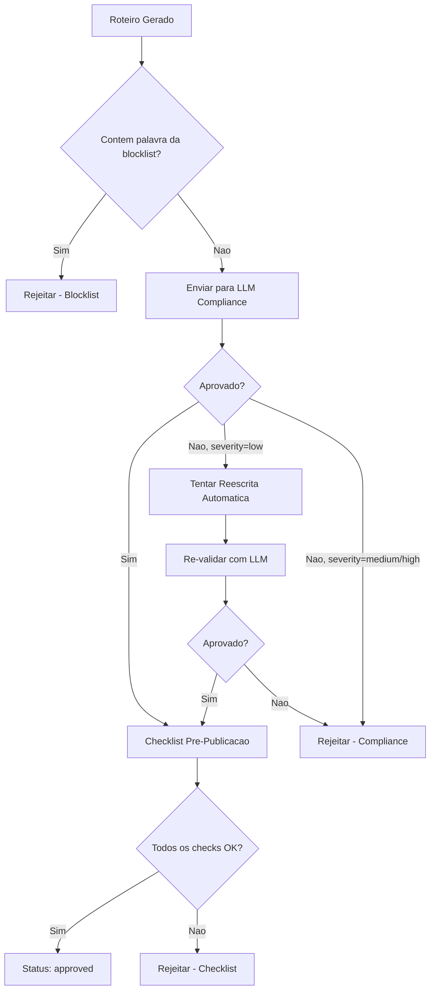

# 07 — Conteudo e Politicas de Compliance

> Sistema automatizado de validacao de conteudo contra politicas das plataformas,
> garantindo que roteiros gerados nao violem regras e evitando remocoes/bans.

---

## 1. Objetivo

Validar automaticamente cada roteiro gerado antes da producao de video, garantindo:
- Conformidade com politicas do TikTok, Instagram e YouTube
- Ausencia de claims proibidos (medicos, financeiros, garantias)
- Linguagem honesta e nao enganosa
- CTAs compativeis com cada plataforma

---

## 2. Proibicoes por Plataforma

### 2.1 TikTok

| Categoria | Proibicoes | Exemplos Proibidos |
|---|---|---|
| Promessas garantidas | Resultados garantidos, "100% eficaz" | "Garanto que voce vai emagrecer" |
| Claims medicos | Curar doencas, substituir tratamento | "Cura acne em 3 dias" |
| Claims financeiros | Renda garantida, enriquecer rapido | "Ganhe R$10.000 por mes garantido" |
| Endorsement falso | Fingir endorsement de celebridade/marca | "Recomendado pela Anvisa" |
| Escassez falsa | Urgencia artificial sem base real | "Ultimas 3 unidades" (se falso) |
| Conteudo enganoso | Antes/depois manipulado, depoimentos falsos | Fotos adulteradas |
| Spam/repetitivo | Mesmo texto/CTA repetido | Copiar roteiro anterior |

### 2.2 Instagram (Reels)

| Categoria | Proibicoes | Detalhes |
|---|---|---|
| Todas do TikTok | Mesmas regras acima | — |
| Marca d'agua TikTok | Nao pode ter logo do TikTok | Gerar video sem marca d'agua |
| Links diretos no video | Instagram nao permite links clicaveis em Reels | Usar "link na bio" como CTA |
| Conteudo reciclado | Instagram penaliza conteudo identico de outra plataforma | Variar caption e hashtags |

### 2.3 YouTube (Shorts)

| Categoria | Proibicoes | Detalhes |
|---|---|---|
| Todas do TikTok | Mesmas regras base | — |
| Clickbait extremo | Titulo/thumbnail que nao reflete o conteudo | Manter coerencia titulo-conteudo |
| Conteudo repetitivo | YouTube penaliza canais com videos muito similares | Variar formato e abordagem |
| Mencao explicita de preco | Pode ser restritivo dependendo do contexto | Preferir "confira o link" |

---

## 3. Metodo de Validacao Automatica

### 3.1 Validacao via LLM (Prompt de Compliance)

O roteiro gerado e enviado para um LLM (GPT-4o-mini ou Claude Haiku) com um prompt
especializado em compliance:

```python
COMPLIANCE_PROMPT = """
Voce e um revisor de compliance para conteudo de video curto.
Analise o roteiro abaixo e verifique se viola alguma das regras listadas.

REGRAS:
1. Nao pode conter promessas garantidas de resultado
2. Nao pode fazer claims medicos (curar, tratar, prevenir doencas)
3. Nao pode fazer claims financeiros (garantir renda, lucro)
4. Nao pode usar endorsement falso (celebridades, instituicoes)
5. Nao pode criar urgencia/escassez artificial sem base real
6. Nao pode conter linguagem enganosa ou manipuladora
7. Nao pode ter conteudo identico a roteiros anteriores
8. CTA deve ser compativel com a plataforma alvo

PLATAFORMA: {platform}

ROTEIRO:
Hook: {hook}
Corpo: {body}
CTA: {cta}
Caption: {caption}

Responda APENAS com um JSON:
{{
    "approved": true/false,
    "violations": ["lista de violacoes encontradas"],
    "severity": "none" | "low" | "medium" | "high",
    "suggestion": "sugestao de correcao se rejeitado"
}}
"""
```

### 3.2 Fluxo de Validacao



---

## 4. Blocklist de Palavras/Frases

### 4.1 Blocklist Hard (rejeicao imediata)

```python
BLOCKLIST_HARD = [
    # Claims medicos
    "cura", "curar", "trata", "tratar", "previne", "prevenir",
    "diagnostico", "prescricao", "remedio", "medicamento",
    "aprovado pela anvisa", "clinicamente comprovado",

    # Claims financeiros
    "fique rico", "enriquecer", "renda garantida", "lucro garantido",
    "ganhe dinheiro facil", "esquema", "pirâmide",
    "retorno garantido", "investimento sem risco",

    # Escassez falsa
    "ultimas unidades", "so hoje", "vai acabar",
    "oferta por tempo limitado",  # a menos que seja verdade verificavel

    # Endorsement
    "recomendado por medicos", "aprovado por dermatologistas",
    "celebridade usa", "famoso usa",

    # Garantias absolutas
    "100% garantido", "resultado garantido", "funciona para todos",
    "nunca falha", "comprovado cientificamente"
]
```

### 4.2 Blocklist Soft (alerta, nao rejeita automaticamente)

```python
BLOCKLIST_SOFT = [
    "melhor do mercado", "numero 1", "mais vendido",
    "revolucionario", "incrivel", "milagroso",
    "voce precisa", "nao viva sem", "essencial"
]
```

---

## 5. Checklist Pre-Publicacao

| # | Check | Metodo | Obrigatorio |
|---|---|---|---|
| 1 | Roteiro nao contem palavras da blocklist hard | String matching | Sim |
| 2 | LLM aprovou o roteiro | API call | Sim |
| 3 | Hash do roteiro e unico (anti-duplicacao) | SHA-256 vs. banco | Sim |
| 4 | Similaridade coseno < 0.85 com ultimos 10 roteiros | TF-IDF + cosine | Sim |
| 5 | CTA compativel com plataforma alvo | Regra por plataforma | Sim |
| 6 | Produto referenciado ainda esta ativo | Check `products.is_active` | Sim |
| 7 | Caption tem hashtags relevantes (2-5) | Contagem | Sim |
| 8 | Duracao estimada do roteiro entre 20-45s | Word count heuristic | Sim |

### CTA por plataforma:

| Plataforma | CTAs Permitidos | CTAs Proibidos |
|---|---|---|
| TikTok | "Link na bio", "TikTok Shop", "Confira o produto" | Links diretos no texto |
| Instagram | "Link na bio", "Confira nos stories" | Links diretos (nao funciona em Reels) |
| YouTube | "Link na descricao", "Confira abaixo" | Links no video (nao clicavel em Shorts) |

---

## 6. Metricas de Compliance

| Metrica | Descricao | Meta |
|---|---|---|
| Taxa de aprovacao | Roteiros aprovados / total gerados | > 80% |
| Taxa de rejeicao por blocklist | Rejeicoes por blocklist / total | < 5% |
| Taxa de rejeicao por LLM | Rejeicoes por LLM / total | < 15% |
| Falsos negativos | Videos removidos pela plataforma apesar de aprovados | < 1% |

---

## Documentos Relacionados

| Documento | Relacao |
|---|---|
| [01_PRD.md](01_PRD.md) | RF-008 — validacao de compliance |
| [02_ARQUITETURA.md](02_ARQUITETURA.md) | script-service executa compliance |
| [08_GERACAO_ROTEIRO_E_PROMPTS.md](08_GERACAO_ROTEIRO_E_PROMPTS.md) | Roteiros gerados passam por este modulo |
| [10_PUBLICACAO_E_AGENDAMENTO.md](10_PUBLICACAO_E_AGENDAMENTO.md) | So publica roteiros aprovados |
| [04_ACCOUNT_HEALTH_ANTI_BAN.md](04_ACCOUNT_HEALTH_ANTI_BAN.md) | Remocoes por compliance afetam health score |
