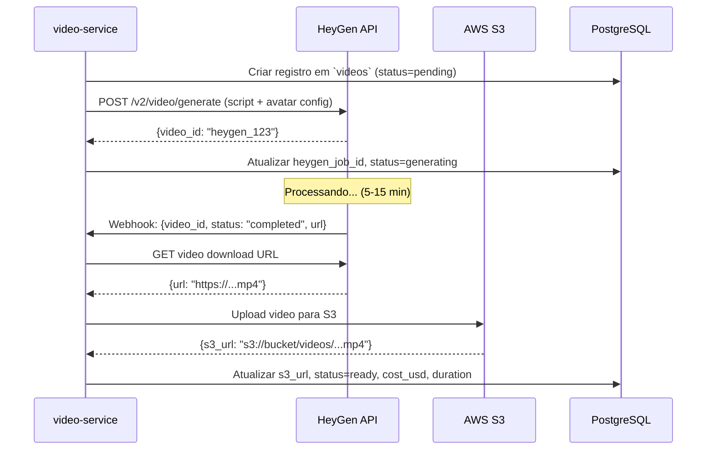

# 09 — Avatar e Geracao de Video

> Integracao com HeyGen API para geracao automatica de videos com avatar
> feminino realista, incluindo configuracao, anti-duplicacao visual e controle de custos.

---

## 1. HeyGen API

### 1.1 Autenticacao

```python
HEYGEN_CONFIG = {
    "API_BASE_URL": "https://api.heygen.com",
    "API_KEY": "{{secrets.HEYGEN_API_KEY}}",  # AWS Secrets Manager
    "API_VERSION": "v2"
}

headers = {
    "X-Api-Key": HEYGEN_CONFIG["API_KEY"],
    "Content-Type": "application/json"
}
```

### 1.2 Endpoint de Geracao

| Endpoint | Metodo | Funcao |
|---|---|---|
| `/v2/video/generate` | POST | Criar video a partir de script + avatar |
| `/v1/video_status.get` | GET | Verificar status do video |
| `/v1/video_status.get?video_id={id}` | GET | Obter URL de download |
| Webhook | POST (callback) | Notificacao de conclusao |

### 1.3 Fluxo de Geracao



### 1.4 Payload de Geracao

```python
payload = {
    "video_inputs": [{
        "character": {
            "type": "avatar",
            "avatar_id": AVATAR_CONFIG["AVATAR_ID"],
            "avatar_style": "normal"
        },
        "voice": {
            "type": "text",
            "input_text": script.hook + " " + script.body + " " + script.cta,
            "voice_id": AVATAR_CONFIG["VOICE_ID"],
            "speed": 1.1
        },
        "background": {
            "type": "color",
            "value": "#FFFFFF"
        }
    }],
    "dimension": {
        "width": 1080,
        "height": 1920
    },
    "aspect_ratio": "9:16",
    "test": False  # True para modo teste (gratis, com marca d'agua)
}
```

---

## 2. Configuracao do Avatar

| Parametro | Valor | Configuravel |
|---|---|---|
| **Avatar ID** | Selecionado do catalogo HeyGen | Sim (`AVATAR_ID`) |
| **Genero** | Feminino | Fixo |
| **Estilo** | Realista (nao cartoon) | Fixo |
| **Expressao** | Neutra/amigavel | Sim |
| **Voz** | Portugues BR feminino | Sim (`VOICE_ID`) |
| **Velocidade da fala** | 1.1x (levemente rapida para short-form) | Sim (`VOICE_SPEED`) |
| **Posicao** | Centralizada, enquadramento busto | Variavel (anti-duplicacao) |

```python
AVATAR_CONFIG = {
    "AVATAR_ID": "avatar_heygen_id_aqui",
    "VOICE_ID": "pt_br_female_01",
    "VOICE_SPEED": 1.1,
    "EXPRESSION": "friendly",
    "BACKGROUND_COLORS": ["#FFFFFF", "#F5F5DC", "#E8E8E8", "#FFF0F5"],
}
```

---

## 3. Composicao do Video

### 3.1 Elementos

| Elemento | Descricao | Obrigatorio |
|---|---|---|
| **Avatar falando** | Avatar feminino narrando o roteiro | Sim |
| **Legendas** | Texto sincronizado com a fala (burned-in) | Sim |
| **B-roll** | Imagens/clips do produto ou relacionados | Recomendado |
| **Musica de fundo** | Trilha sonora leve ou trending | Recomendado |
| **Efeitos** | Transicoes, zoom, highlight de texto | Opcional |

### 3.2 Especificacoes Tecnicas

| Parametro | Valor |
|---|---|
| Formato | MP4 (H.264) |
| Resolucao | 1080 x 1920 (9:16) |
| Duracao | 20-45 segundos |
| FPS | 30 |
| Audio | AAC, stereo |
| Tamanho estimado | 5-15 MB por video |

---

## 4. Anti-Duplicacao Visual

Para evitar que a plataforma detecte conteudo repetitivo, variar elementos visuais entre videos:

| Elemento | Variacoes | Metodo |
|---|---|---|
| Posicao das legendas | Topo, centro, base | Rotacionar por video |
| Cor das legendas | Branco, amarelo, rosa | Aleatorio |
| Fonte das legendas | 3-4 fontes pre-definidas | Aleatorio |
| Cor de fundo | 4 cores neutras | Aleatorio |
| B-roll | Pool de clips por categoria | Aleatorio |
| Layout | Avatar esquerda, centro, direita | Rotacionar |
| Musica | Pool de 10+ trilhas | Aleatorio |

```python
import random

def get_visual_variation():
    return {
        "subtitle_position": random.choice(["top", "center", "bottom"]),
        "subtitle_color": random.choice(["#FFFFFF", "#FFD700", "#FFB6C1"]),
        "subtitle_font": random.choice(["Montserrat", "Poppins", "Inter", "Roboto"]),
        "background_color": random.choice(AVATAR_CONFIG["BACKGROUND_COLORS"]),
        "avatar_position": random.choice(["left", "center", "right"]),
        "music_track": random.choice(MUSIC_LIBRARY)
    }
```

---

## 5. Custo Estimado por Video

| Plano HeyGen | Creditos/mes | Videos/mes (~30s) | Custo/video |
|---|---|---|---|
| Creator ($24/mes) | 15 min | ~30 videos | ~$0.80 |
| Business ($60/mes) | 30 min | ~60 videos | ~$1.00 |
| Enterprise | Custom | Custom | Negociavel |

**Estimativa mensal:**
- Fase 1: ~30 videos/mes × $0.80 = **~$24/mes** (plano Creator)
- Fase 3: ~90 videos/mes × $1.00 = **~$60-90/mes** (plano Business)

Custo e registrado na coluna `videos.cost_usd` para tracking.

---

## 6. Fallback e Controle de Custos

### 6.1 Retry em Caso de Falha

```python
RETRY_CONFIG = {
    "MAX_RETRIES": 3,
    "BACKOFF_SECONDS": [300, 600, 1200],  # 5min, 10min, 20min
    "TIMEOUT_SECONDS": 1200               # 20min max para geracao
}
```

| Cenario | Acao |
|---|---|
| HeyGen retorna erro 500 | Retry com backoff exponencial |
| HeyGen retorna erro 429 (rate limit) | Aguardar tempo indicado no header |
| Timeout (> 20 min) | Cancelar + retry |
| 3 retries falharam | Marcar video como FAILED + alerta |
| HeyGen completamente fora do ar | Ativar fila de espera, retry em 1h |

### 6.2 Limite de Gasto Diario

```python
COST_CONFIG = {
    "DAILY_BUDGET_USD": 5.00,
    "MAX_VIDEOS_PER_DAY": 5,
    "ALERT_THRESHOLD_PCT": 80  # alertar quando 80% do budget usado
}

def check_daily_budget():
    today_cost = sum(videos.cost_usd WHERE created_at = today)
    if today_cost >= COST_CONFIG["DAILY_BUDGET_USD"]:
        raise BudgetExceededError("Limite diario de gasto atingido")
    if today_cost >= COST_CONFIG["DAILY_BUDGET_USD"] * 0.8:
        send_alert("Budget 80% consumido")
```

---

## 7. Musica

| Estrategia | Fonte | Implementacao |
|---|---|---|
| Biblioteca royalty-free | Pixabay, Mixkit, Artlist | Pool local de 20+ trilhas |
| Sons trending TikTok | TikTok Creative Center | Verificar musicas trending (se API permitir) |
| Sem musica | Para videos mais conversacionais | Configuravel |

**Regras:**
- Volume da musica: 15-20% do volume da voz
- Musica nao pode ter copyright strike
- Variar musica entre videos (anti-duplicacao)
- Trilha deve combinar com a categoria (energetica para fitness, suave para skincare)

---

## 8. Saida

Video gerado e armazenado no S3 com metadados:

```python
{
    "video_id": 1,
    "script_id": 42,
    "provider": "heygen",
    "duration": 32.5,
    "s3_url": "s3://aiafiliado-videos/2025/03/15/video_001.mp4",
    "hash": "a1b2c3d4...",
    "cost_usd": 0.80,
    "status": "ready",
    "heygen_job_id": "heygen_abc123",
    "created_at": "2025-03-15T10:30:00Z"
}
```

---

## Documentos Relacionados

| Documento | Relacao |
|---|---|
| [01_PRD.md](01_PRD.md) | RF-010, RF-019 |
| [02_ARQUITETURA.md](02_ARQUITETURA.md) | video-service — contrato de task |
| [03_DADOS_E_SCHEMAS.md](03_DADOS_E_SCHEMAS.md) | Tabela `videos` |
| [08_GERACAO_ROTEIRO_E_PROMPTS.md](08_GERACAO_ROTEIRO_E_PROMPTS.md) | Fornece roteiros para geracao |
| [10_PUBLICACAO_E_AGENDAMENTO.md](10_PUBLICACAO_E_AGENDAMENTO.md) | Consome videos prontos |
| [12_INFRA_CLOUD_DEPLOY.md](12_INFRA_CLOUD_DEPLOY.md) | S3 bucket para armazenamento |
