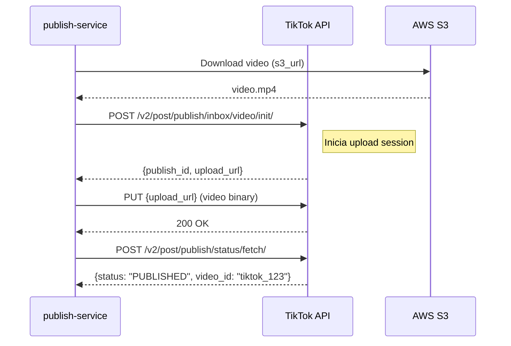
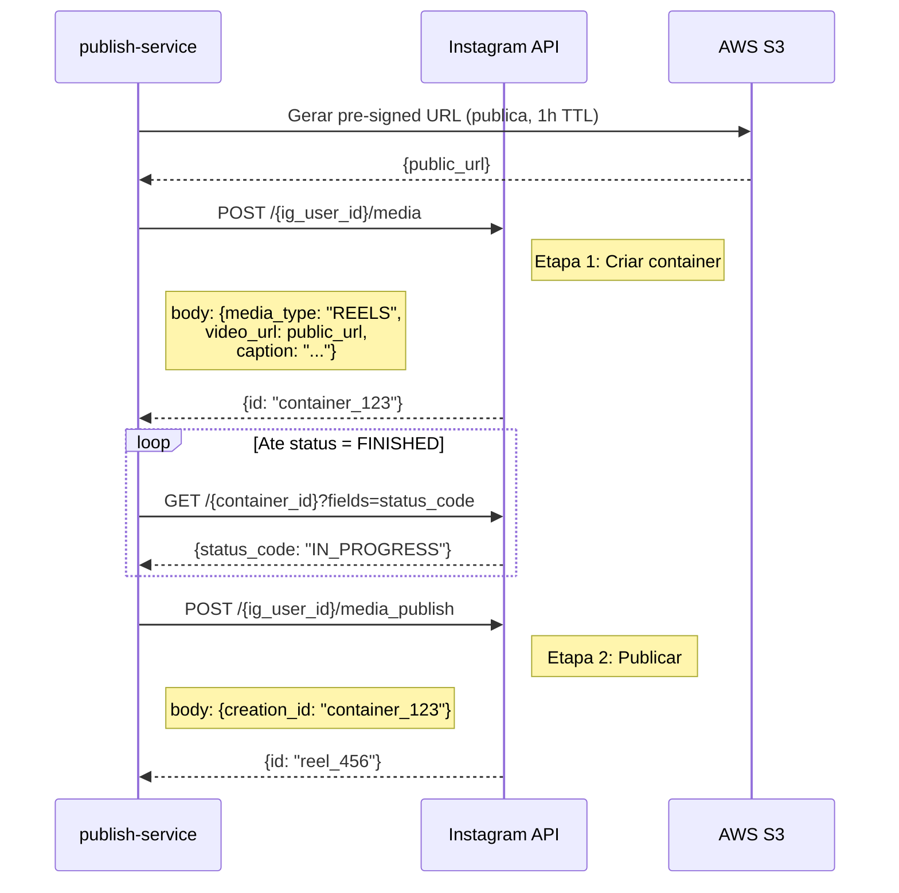
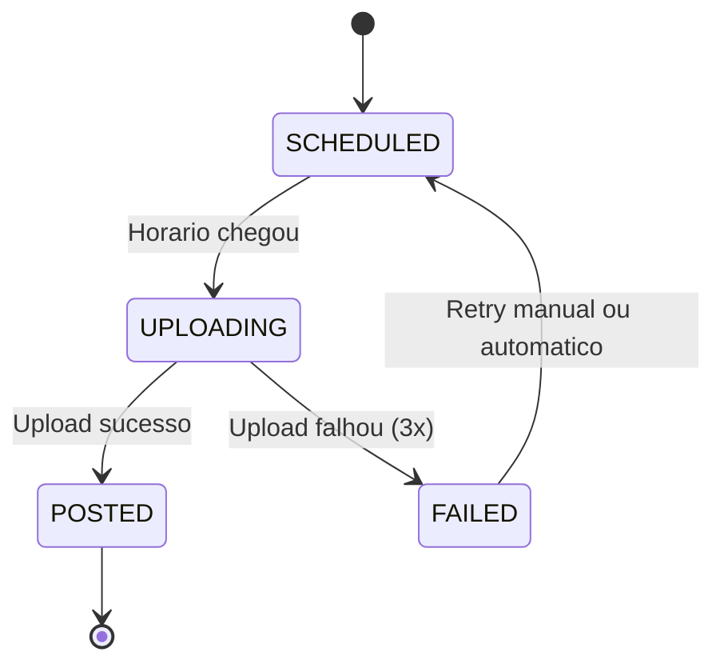

# 10 — Publicacao e Agendamento

> Sistema de publicacao de videos nas plataformas via APIs oficiais (TikTok, Instagram, YouTube),
> com agendamento inteligente, cooldowns e retry logic.

---

## 1. TikTok Content Posting API

### 1.1 Autenticacao OAuth 2.0

| Parametro | Valor |
|---|---|
| **Auth URL** | `https://www.tiktok.com/v2/auth/authorize/` |
| **Token URL** | `https://open.tiktokapis.com/v2/oauth/token/` |
| **Scopes** | `user.info.basic`, `video.publish`, `video.upload` |
| **Grant type** | Authorization Code |
| **Token refresh** | Automatico antes do vencimento (24h de validade) |

### 1.2 Fluxo de Upload



### 1.3 Campos da Publicacao

```python
tiktok_payload = {
    "post_info": {
        "title": script.caption[:150],          # max 150 chars
        "privacy_level": "PUBLIC_TO_EVERYONE",
        "disable_duet": False,
        "disable_comment": False,
        "disable_stitch": False,
        "video_cover_timestamp_ms": 1000        # thumbnail no 1o segundo
    },
    "source_info": {
        "source": "FILE_UPLOAD",
        "video_size": video.file_size,
        "chunk_size": 10000000,                 # 10MB chunks
        "total_chunk_count": 1
    }
}
```

### 1.4 Limites

| Limite | Valor |
|---|---|
| Tamanho max do video | 287.6 MB |
| Duracao max | 10 minutos |
| Uploads/dia | Sem limite oficial (mas Account Health Gate limita) |
| Rate limit API | 600 requests/dia |

---

## 2. Instagram Graph API (Reels)

### 2.1 Requisitos

| Requisito | Detalhes |
|---|---|
| Tipo de conta | Business ou Creator |
| Facebook Page | Vinculada a conta Instagram |
| App type | Facebook App com permissoes de Instagram |
| Scopes | `instagram_basic`, `instagram_content_publish` |
| Token | Long-lived token (60 dias) com refresh automatico |

### 2.2 Fluxo de Upload (2 etapas)



### 2.3 Campos

```python
instagram_payload = {
    "media_type": "REELS",
    "video_url": s3_presigned_url,
    "caption": script.caption,           # inclui hashtags
    "share_to_feed": True,
    "cover_url": None,                   # usar frame automatico
    "location_id": None,                 # sem localizacao
    "thumb_offset": 1000                 # ms para thumbnail
}
```

### 2.4 Delay Apos TikTok

| Parametro | Default | Configuravel |
|---|---|---|
| Delay minimo | 24 horas apos publicacao no TikTok | Sim (`INSTAGRAM_DELAY_HOURS`) |
| Motivo | Evitar que Instagram penalize conteudo replicado | — |
| Variacao | Caption e hashtags DEVEM ser diferentes do TikTok | — |

---

## 3. YouTube Data API v3

### 3.1 Upload via Resumable Upload

| Parametro | Valor |
|---|---|
| **Endpoint** | `https://www.googleapis.com/upload/youtube/v3/videos` |
| **Metodo** | Resumable Upload (para arquivos > 5MB) |
| **Scopes** | `youtube.upload`, `youtube.readonly` |
| **Autenticacao** | OAuth 2.0 (Google Cloud Console) |
| **Token refresh** | Automatico via refresh_token |

### 3.2 Fluxo

```python
# Etapa 1: Iniciar upload
response = youtube.videos().insert(
    part="snippet,status",
    body={
        "snippet": {
            "title": script.hook[:100],
            "description": build_youtube_description(script, product),
            "tags": extract_tags(script.caption),
            "categoryId": "22"           # People & Blogs
        },
        "status": {
            "privacyStatus": "public",
            "selfDeclaredMadeForKids": False,
            "embeddable": True
        }
    },
    media_body=MediaFileUpload(video_path, resumable=True)
)

# Etapa 2: Upload resumable
while response is None:
    status, response = request.next_chunk()
```

### 3.3 Metadata

```python
def build_youtube_description(script, product):
    return f"""{script.body}

{script.cta}

Link: {product.affiliate_url}

#Shorts {script.caption}
"""
```

### 3.4 Delay Apos Instagram

| Parametro | Default | Configuravel |
|---|---|---|
| Delay minimo | 48 horas apos publicacao no Instagram | Sim (`YOUTUBE_DELAY_HOURS`) |
| Motivo | Diversificar timing, evitar content farming detection | — |
| Variacao | Titulo e descricao DEVEM ser diferentes | — |

---

## 4. Regras de Agendamento

### 4.1 Horarios Otimos por Plataforma

| Plataforma | Horarios Otimos (BR) | Dias Fortes |
|---|---|---|
| TikTok | 12h, 18h, 21h | Ter, Qui, Sab |
| Instagram | 11h, 17h, 20h | Seg, Qua, Sex |
| YouTube | 10h, 15h, 19h | Qua, Sex, Dom |

**Implementacao:** Pool de horarios com rotacao para evitar padrao previsivel.

```python
import random

SCHEDULE_WINDOWS = {
    "tiktok": [
        {"hour": 12, "minute_range": (0, 30)},
        {"hour": 18, "minute_range": (0, 30)},
        {"hour": 21, "minute_range": (0, 30)}
    ],
    "instagram": [
        {"hour": 11, "minute_range": (0, 30)},
        {"hour": 17, "minute_range": (0, 30)},
        {"hour": 20, "minute_range": (0, 30)}
    ],
    "youtube": [
        {"hour": 10, "minute_range": (0, 30)},
        {"hour": 15, "minute_range": (0, 30)},
        {"hour": 19, "minute_range": (0, 30)}
    ]
}

def pick_schedule_time(platform: str) -> datetime:
    window = random.choice(SCHEDULE_WINDOWS[platform])
    minute = random.randint(*window["minute_range"])
    return today.replace(hour=window["hour"], minute=minute)
```

### 4.2 Cooldown entre Posts

| Risk Level | Cooldown Minimo | Posts/dia |
|---|---|---|
| LOW | 2 horas | Max 3 |
| MEDIUM | 4 horas | Max 1 |
| HIGH | N/A | 0 (pausado) |

### 4.3 Regras Anti-Rajada

| Regra | Descricao |
|---|---|
| Max 1 post por plataforma por janela | Nao publicar 2 videos no TikTok no mesmo horario |
| Delay entre plataformas | TikTok primeiro → Instagram (+24h) → YouTube (+48h) |
| Sem rajadas | Minimo 2h entre quaisquer 2 publicacoes |

---

## 5. Retry Logic

```python
PUBLISH_RETRY_CONFIG = {
    "MAX_RETRIES": 3,
    "BACKOFF_SECONDS": [60, 300, 600],    # 1min, 5min, 10min
    "RETRY_ON_ERRORS": [429, 500, 502, 503, 504]
}
```

| Cenario | Acao |
|---|---|
| Erro 429 (rate limit) | Aguardar Retry-After header |
| Erro 5xx | Retry com backoff exponencial |
| Erro 401 (token expirado) | Refresh token automatico + retry |
| Erro 400 (video invalido) | Nao fazer retry, marcar FAILED |
| 3 retries falharam | Marcar FAILED + alerta + reagendar proxima janela |

---

## 6. Estados da Publicacao



| Estado | Descricao |
|---|---|
| `SCHEDULED` | Agendado para publicacao em horario especifico |
| `UPLOADING` | Upload em andamento |
| `POSTED` | Publicado com sucesso (`external_id` preenchido) |
| `FAILED` | Falhou apos retries (`error_message` preenchido) |

---

## Documentos Relacionados

| Documento | Relacao |
|---|---|
| [01_PRD.md](01_PRD.md) | RF-011 a RF-013, RF-017, RF-020 |
| [02_ARQUITETURA.md](02_ARQUITETURA.md) | publish-service — contrato de task |
| [03_DADOS_E_SCHEMAS.md](03_DADOS_E_SCHEMAS.md) | Tabela `publications` |
| [04_ACCOUNT_HEALTH_ANTI_BAN.md](04_ACCOUNT_HEALTH_ANTI_BAN.md) | Consome posts_allowed e cooldown |
| [09_AVATAR_E_GERACAO_DE_VIDEO.md](09_AVATAR_E_GERACAO_DE_VIDEO.md) | Fornece videos prontos |
| [11_TRACKING_E_OTIMIZACAO.md](11_TRACKING_E_OTIMIZACAO.md) | Rastreia publicacoes apos post |
