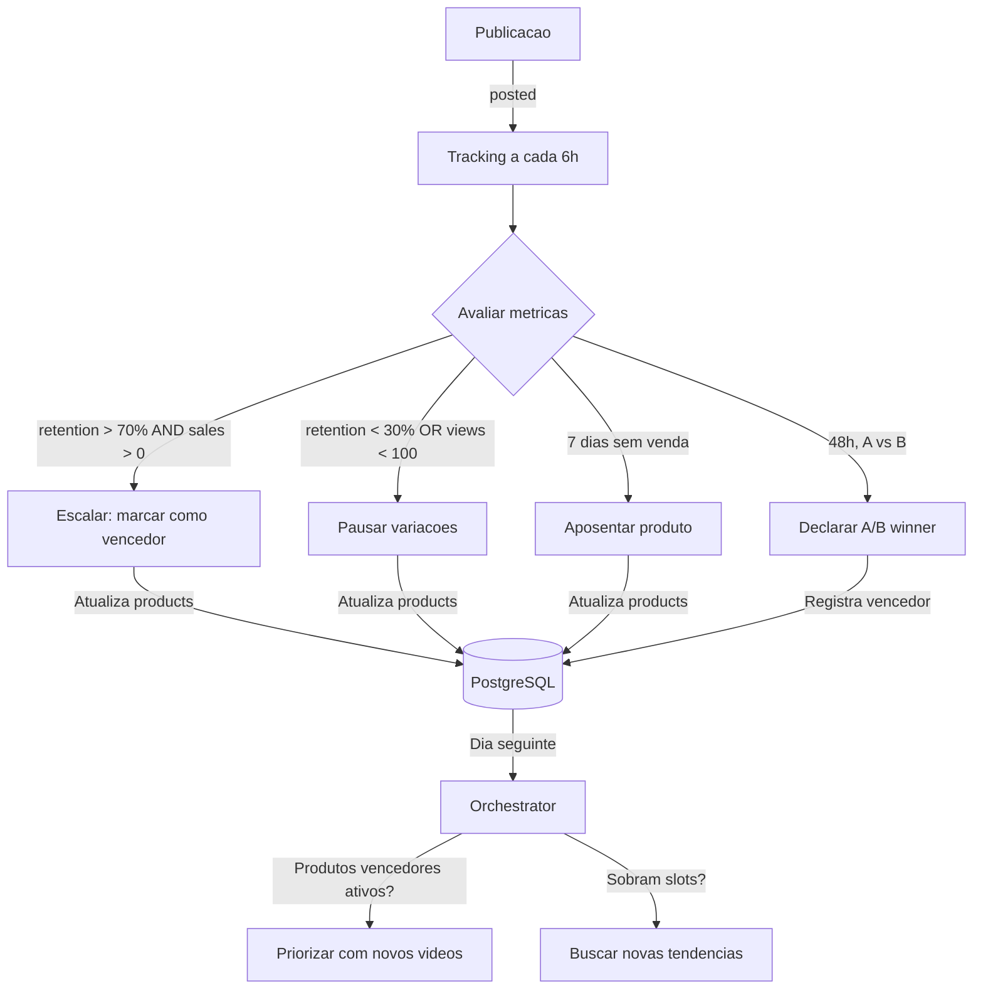

# 11 — Tracking e Otimizacao

> Sistema de coleta de metricas, identificacao de vencedores, loop de otimizacao
> e feedback para producao do dia seguinte.

---

## 1. Coleta de Metricas

### 1.1 Frequencia e Janela

| Parametro | Valor |
|---|---|
| Frequencia de coleta | A cada 6 horas |
| Janela de rastreamento | 7 dias apos publicacao |
| Total de coletas por video | ~28 snapshots (4/dia x 7 dias) |
| Metodo | Cron job independente (Celery beat) |

### 1.2 APIs de Coleta por Plataforma

**TikTok:**
```python
# TikTok Content API — Video Insights
GET /v2/video/query/
# Campos: views, likes, comments, shares
# Retencao: disponivel via TikTok Analytics API (Creator scope)
```

**Instagram:**
```python
# Instagram Graph API — Media Insights
GET /{media_id}/insights?metric=plays,likes,comments,shares,reach
# Retencao 3s: nao disponivel diretamente, estimar via reach/plays
```

**YouTube:**
```python
# YouTube Analytics API
GET /v2/reports?metrics=views,likes,comments,shares,averageViewDuration
# Retencao 3s: calcular via averageViewDuration / total_duration
```

### 1.3 Tracking de Vendas e Clicks

| Plataforma | Metodo de Tracking | Dados |
|---|---|---|
| TikTok Shop | TikTok Shop Affiliate API — dashboard de vendas | Vendas, receita, comissao |
| Hotmart | Hotmart API — webhook de venda / endpoint de relatorio | Vendas, receita |
| Monetizze | Monetizze API — relatorio de vendas | Vendas, receita |
| Amazon | Product Advertising API — relatorio de earnings | Clicks, vendas, receita |
| Shopee | Shopee Affiliate API — relatorio de performance | Clicks, vendas, receita |

**Mapeamento venda ↔ video:**
```python
# Cada publicacao tem um affiliate_url unico (ou com parametro UTM)
# Vendas sao atribuidas ao produto/publicacao via:
# 1. Janela de tempo: venda ocorreu ate 7 dias apos publicacao
# 2. Mesmo produto: product_id match
# 3. Plataforma: match entre plataforma da publicacao e fonte da venda
```

---

## 2. Metricas Rastreadas

| Metrica | Fonte | Tabela | Coluna |
|---|---|---|---|
| Views | API plataforma | `metrics` | `views` |
| Likes | API plataforma | `metrics` | `likes` |
| Comments | API plataforma | `metrics` | `comments` |
| Shares | API plataforma | `metrics` | `shares` |
| Retencao 3s | API plataforma / calculado | `metrics` | `retention_3s` |
| Clicks no link | API afiliado | `metrics` | `clicks` |
| Vendas | API afiliado | `metrics` | `sales` |
| Receita | API afiliado | `metrics` | `revenue` |

Cada coleta gera um novo registro em `metrics` (snapshot temporal), permitindo
analisar evolucao ao longo do tempo.

---

## 3. Regras de Decisao

### 3.1 Escalar Vencedor

```python
def should_scale(publication_id: int) -> bool:
    latest = get_latest_metrics(publication_id)
    return (
        latest.retention_3s > 0.70          # Retencao > 70%
        AND latest.sales > 0                # Pelo menos 1 venda
    )
```

**Acoes ao escalar:**
- Marcar produto como `is_active = TRUE`
- Atualizar `products.total_sales` e `products.total_revenue`
- Sinalizar para o orchestrator: gerar **mais videos** com roteiros diferentes
- Permite mais de 1 video/dia para este produto (respeitando Account Health Gate)

### 3.2 Pausar

```python
def should_pause(publication_id: int) -> bool:
    latest = get_latest_metrics(publication_id)
    hours_since_post = (now - publication.posted_at).total_hours()
    return (
        (latest.retention_3s < 0.30 AND hours_since_post > 24)
        OR (latest.views < 100 AND hours_since_post > 24)
    )
```

**Acoes ao pausar:**
- Nao gerar mais variacoes deste roteiro
- Se todas as publicacoes do produto estao pausadas → considerar aposentar

### 3.3 A/B Winner

```python
def determine_ab_winner(product_id: int, hours_threshold: int = 48) -> str:
    """Apos 48h, determinar qual variante (A ou B) performou melhor."""
    variants = get_published_variants(product_id, min_age_hours=hours_threshold)

    if len(variants) < 2:
        return None  # Aguardar mais dados

    variant_a = [v for v in variants if v.variant == 'A']
    variant_b = [v for v in variants if v.variant == 'B']

    ctr_a = sum(v.clicks for v in variant_a) / max(sum(v.views for v in variant_a), 1)
    ctr_b = sum(v.clicks for v in variant_b) / max(sum(v.views for v in variant_b), 1)

    return 'A' if ctr_a > ctr_b else 'B'
```

**Acoes:**
- Variante vencedora informa o estilo de proximos roteiros
- Logs registram motivo da decisao

### 3.4 Aposentar

```python
def should_retire(product_id: int) -> bool:
    product = get_product(product_id)
    return (
        product.is_active == True
        AND not has_sale_in_days(product_id, days=7)
    )
```

**Acoes ao aposentar:**
- `products.is_active = FALSE`
- `products.status = 'retired'`
- Liberar slot para novos produtos
- Log: motivo da aposentadoria

---

## 4. Loop Fechado de Reaproveitamento

### 4.1 Diagrama do Feedback Loop



### 4.2 Como o Tracking Alimenta a Producao

| Dado do Tracking | Impacto no Dia Seguinte |
|---|---|
| Produto com vendas recentes | Recebe prioridade — novos videos gerados primeiro |
| Variante A venceu | Proximos roteiros seguem estilo da variante A |
| Produto sem vendas ha 7 dias | Aposentado — slot liberado para novo produto |
| Retencao < 30% | Estilo de hook/CTA e marcado como ineficaz |
| Tendencia com boas metricas | Score da tendencia e ajustado para cima no proximo dia |

### 4.3 Multiplos Videos por Dia para Vencedores

Quando um produto e vencedor, o sistema pode gerar **mais de 1 video/dia** para ele:

```python
if product.is_winner and health_gate.posts_allowed > 1:
    # Gerar ate 2 videos/dia para este produto (respeitando health gate)
    videos_today = min(2, health_gate.posts_allowed)
    for i in range(videos_today):
        generate_variant_script(product, variant_style=random.choice(['A', 'B']))
```

Limites respeitados:
- `MAX_VIDEOS_PER_PRODUCT_DAY` (default: 2)
- `MAX_VIDEOS_PER_PRODUCT_WEEK` (default: 5)
- `health_gate.posts_allowed` (define teto diario total)

---

## 5. Loop de Aprendizado

### 5.1 Feedback para Trend Scoring

```python
def update_trend_score_with_feedback(trend_id: int):
    """Ajusta score da tendencia baseado em performance real."""
    publications = get_publications_for_trend(trend_id)

    avg_retention = mean([p.latest_metrics.retention_3s for p in publications])
    total_sales = sum([p.latest_metrics.sales for p in publications])

    if avg_retention > 0.7 and total_sales > 0:
        trend.score = min(100, trend.score * 1.1)   # +10%
    elif avg_retention < 0.3 and total_sales == 0:
        trend.score = max(0, trend.score * 0.7)      # -30%
```

### 5.2 Feedback para Product Scoring

```python
def update_product_score_with_feedback(product_id: int):
    """Ajusta score comercial baseado em vendas reais."""
    total_sales = get_total_sales(product_id)
    total_videos = get_total_videos(product_id)

    conversion_rate = total_sales / max(total_videos, 1)

    if conversion_rate > 0.5:    # > 50% dos videos geraram venda
        product.score = min(100, product.score * 1.2)
    elif conversion_rate == 0:   # nenhum video gerou venda
        product.score = max(0, product.score * 0.8)
```

---

## 6. Dashboard de Metricas

Dados disponibilizados para visualizacao (dashboard futuro):

### 6.1 Metricas Diarias

| Metrica | Query |
|---|---|
| Videos gerados hoje | `COUNT(videos WHERE created_at = today)` |
| Videos publicados hoje | `COUNT(publications WHERE posted_at = today AND status = 'POSTED')` |
| Views totais (ultimas 24h) | `SUM(latest metrics.views)` por publicacao das ultimas 24h |
| Vendas hoje | `SUM(latest metrics.sales)` das publicacoes ativas |
| Receita hoje | `SUM(latest metrics.revenue)` |
| Custo hoje | `SUM(videos.cost_usd WHERE created_at = today)` |

### 6.2 Metricas Semanais/Mensais

| Metrica | Descricao |
|---|---|
| ROI | `(receita_total - custo_total) / custo_total * 100` |
| Taxa de sucesso | `publicacoes POSTED / total` |
| Media de retencao 3s | Media de `retention_3s` de todas publicacoes |
| Produtos ativos | `COUNT(products WHERE is_active = TRUE)` |
| Taxa de remocao | `publicacoes removidas / total` |
| Custo por venda | `custo_total / vendas_totais` |

---

## Documentos Relacionados

| Documento | Relacao |
|---|---|
| [01_PRD.md](01_PRD.md) | RF-014 a RF-016, RF-021, RF-022, RF-023 — KPIs |
| [02_ARQUITETURA.md](02_ARQUITETURA.md) | analytics-service — contrato de task |
| [03_DADOS_E_SCHEMAS.md](03_DADOS_E_SCHEMAS.md) | Tabela `metrics` |
| [06_PRODUTOS_E_VALIDACAO_COMERCIAL.md](06_PRODUTOS_E_VALIDACAO_COMERCIAL.md) | Atualiza status de produtos vencedores/aposentados |
| [04_ACCOUNT_HEALTH_ANTI_BAN.md](04_ACCOUNT_HEALTH_ANTI_BAN.md) | Metricas de alcance alimentam health score |
| [13_OBSERVABILIDADE_E_RUNBOOK.md](13_OBSERVABILIDADE_E_RUNBOOK.md) | Alertas baseados em metricas de negocio |
