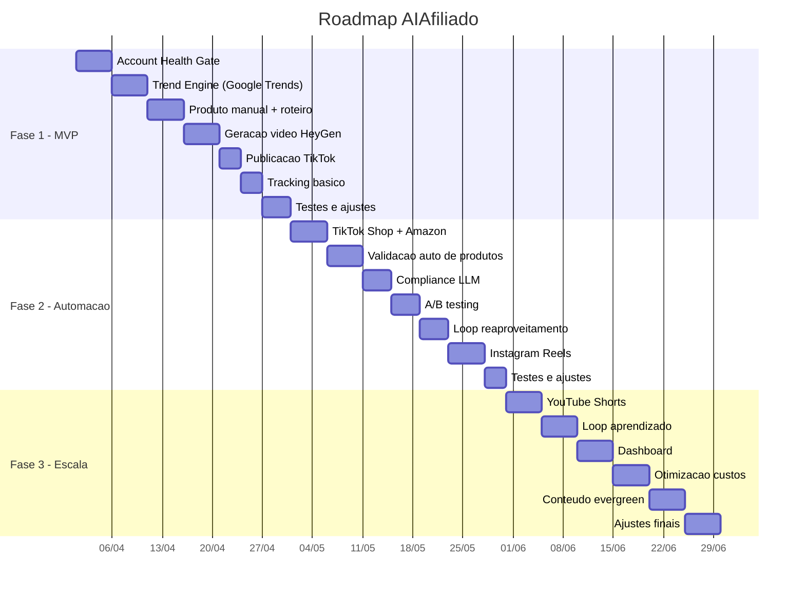
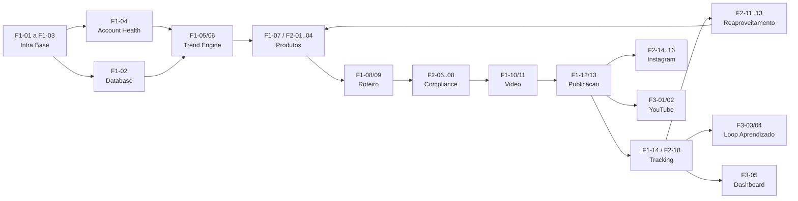

# 14 — Roadmap e Backlog

> Fases de implementacao do projeto AIAfiliado, com backlog priorizado,
> milestones e criterios de transicao entre fases.

---

## 1. Visao Geral das Fases

---

## 2. Fase 1 — MVP (Semanas 1-4)

**Objetivo:** Validar o pipeline end-to-end com TikTok only, publicando videos automaticamente sem ban.

### 2.1 Backlog

| # | Task | Modulo | Prioridade | Estimativa |
|---|---|---|---|---|
| F1-01 | Setup projeto Python + Docker Compose | Infra | MUST | 2d |
| F1-02 | Configurar PostgreSQL + Alembic + criar tabelas | Dados | MUST | 2d |
| F1-03 | Configurar Celery + Redis | Infra | MUST | 1d |
| F1-04 | Implementar Account Health Gate (scoring + niveis) | Account Health | MUST | 3d |
| F1-05 | Implementar coleta Google Trends (pytrends) | Trend Engine | MUST | 2d |
| F1-06 | Implementar scoring de tendencias (basico) | Trend Engine | MUST | 2d |
| F1-07 | Cadastrar 1 produto manualmente (para teste) | Produtos | MUST | 1d |
| F1-08 | Implementar geracao de roteiro via LLM | Script | MUST | 3d |
| F1-09 | Implementar anti-duplicacao (hash SHA-256) | Script | MUST | 1d |
| F1-10 | Integrar HeyGen API (geracao de video) | Video | MUST | 3d |
| F1-11 | Implementar upload S3 | Video | MUST | 1d |
| F1-12 | Integrar TikTok Content Posting API | Publicacao | MUST | 3d |
| F1-13 | Implementar cooldown e limites do health gate | Publicacao | MUST | 1d |
| F1-14 | Implementar coleta basica de metricas (views, likes) | Tracking | MUST | 2d |
| F1-15 | Implementar orchestrator (pipeline diario) | Arquitetura | MUST | 2d |
| F1-16 | Testes de integracao | QA | MUST | 2d |
| F1-17 | Deploy em AWS (EC2 ou ECS) | Infra | MUST | 2d |

### 2.2 Criterios de Conclusao (Fase 1 → Fase 2)

| Criterio | Meta |
|---|---|
| Videos publicados sem ban | >= 10 videos publicados no TikTok sem strike/remocao |
| Pipeline end-to-end funcionando | Trend → Roteiro → Video → Publicacao → Tracking |
| Account Health Gate operacional | Score calculado corretamente, limites respeitados |
| Custo dentro do budget | < $75/mes |
| Uptime do pipeline | > 90% dos dias executou com sucesso |

---

## 3. Fase 2 — Automacao Completa (Semanas 5-8)

**Objetivo:** Automatizar selecao de produtos, compliance, A/B testing, reaproveitamento de vencedores e publicacao multiplataforma.

### 3.1 Backlog

| # | Task | Modulo | Prioridade | Estimativa |
|---|---|---|---|---|
| F2-01 | Integrar TikTok Shop Affiliate API | Produtos | MUST | 3d |
| F2-02 | Integrar Amazon Associates API | Produtos | SHOULD | 2d |
| F2-03 | Integrar Shopee Affiliate API | Produtos | SHOULD | 2d |
| F2-04 | Integrar Hotmart/Monetizze API | Produtos | SHOULD | 2d |
| F2-05 | Implementar validacao automatica de produtos (score comercial) | Produtos | MUST | 3d |
| F2-06 | Implementar compliance LLM (prompt de validacao) | Compliance | MUST | 2d |
| F2-07 | Implementar blocklist hard/soft | Compliance | MUST | 1d |
| F2-08 | Implementar checklist pre-publicacao automatizado | Compliance | MUST | 2d |
| F2-09 | Implementar variantes A/B (2 hooks x 2 CTAs) | Script | MUST | 2d |
| F2-10 | Implementar similaridade coseno (anti-duplicacao) | Script | MUST | 2d |
| F2-11 | Implementar logica de reaproveitamento de vencedores | Produtos/Tracking | MUST | 3d |
| F2-12 | Implementar aposentadoria automatica de produtos | Tracking | MUST | 1d |
| F2-13 | Implementar determinacao de A/B winner | Tracking | MUST | 2d |
| F2-14 | Integrar Instagram Graph API (Reels) | Publicacao | SHOULD | 3d |
| F2-15 | Implementar delay entre plataformas (TikTok → IG) | Publicacao | SHOULD | 1d |
| F2-16 | Implementar agendamento inteligente (horarios otimos) | Publicacao | SHOULD | 2d |
| F2-17 | Implementar anti-duplicacao visual (variacao layout) | Video | SHOULD | 2d |
| F2-18 | Coleta de metricas de vendas (APIs afiliados) | Tracking | MUST | 3d |
| F2-19 | Testes de integracao multiplataforma | QA | MUST | 2d |

### 3.2 Criterios de Conclusao (Fase 2 → Fase 3)

| Criterio | Meta |
|---|---|
| Produtos selecionados automaticamente | >= 5 produtos validados por semana |
| Compliance funcionando | Taxa de rejeicao por plataforma < 1% |
| A/B testing operacional | Winner declarado apos 48h |
| Pelo menos 1 venda | >= 1 venda real via afiliacao |
| Instagram operacional | >= 5 Reels publicados |
| Loop de vencedores | Pelo menos 1 produto re-usado com sucesso |

---

## 4. Fase 3 — Escala e Otimizacao (Semanas 9-12)

**Objetivo:** Expandir para YouTube, implementar loop de aprendizado, dashboard, otimizar custos e criar conteudo evergreen.

### 4.1 Backlog

| # | Task | Modulo | Prioridade | Estimativa |
|---|---|---|---|---|
| F3-01 | Integrar YouTube Data API v3 (Shorts) | Publicacao | SHOULD | 3d |
| F3-02 | Implementar delay TikTok → IG → YT | Publicacao | SHOULD | 1d |
| F3-03 | Implementar feedback loop para trend scoring | Tracking | MUST | 3d |
| F3-04 | Implementar feedback loop para product scoring | Tracking | MUST | 2d |
| F3-05 | Dashboard de metricas (CloudWatch ou Grafana) | Observabilidade | SHOULD | 5d |
| F3-06 | Otimizacao de custos (lifecycle S3, right-sizing) | Infra | SHOULD | 2d |
| F3-07 | Implementar conteudo evergreen (roteiros atemporais) | Script | COULD | 3d |
| F3-08 | Implementar TikTok Creative Center scraping | Trend Engine | SHOULD | 3d |
| F3-09 | Melhorar anti-duplicacao visual (mais variacoes) | Video | COULD | 2d |
| F3-10 | Implementar alertas CloudWatch completos | Observabilidade | MUST | 2d |
| F3-11 | Escrever runbooks operacionais | Observabilidade | SHOULD | 2d |
| F3-12 | Otimizar prompts LLM com base em dados reais | Script | SHOULD | 3d |
| F3-13 | Implementar rotacao de musica (pool expandido) | Video | COULD | 1d |
| F3-14 | Testes de carga e stress | QA | SHOULD | 2d |
| F3-15 | Documentacao final e refinamentos | Docs | SHOULD | 2d |

### 4.2 Criterios de Conclusao (Fase 3)

| Criterio | Meta |
|---|---|
| 3 plataformas operacionais | TikTok + Instagram + YouTube |
| ROI positivo | Receita mensal > custo mensal |
| Loop de aprendizado funcionando | Scoring ajustado automaticamente |
| Dashboard operacional | Metricas visiveis em tempo real |
| Custo otimizado | < $140/mes |
| Zero bans em 30 dias | Nenhum ban/strike |

---

## 5. Backlog Futuro (Pos-Fase 3)

| # | Task | Descricao | Prioridade |
|---|---|---|---|
| BF-01 | Suporte a outros idiomas (EN, ES) | Expandir mercado | LOW |
| BF-02 | Multiplos avatares | Variar persona | LOW |
| BF-03 | Conteudo educativo / tutorial | Diversificar formato | LOW |
| BF-04 | Integracao com mais plataformas de afiliados | Kwai, Magalu | LOW |
| BF-05 | ML para previsao de tendencias | Modelo preditivo | LOW |
| BF-06 | Dashboard web interativo | App Flask/Streamlit | MEDIUM |
| BF-07 | Notificacoes Telegram/Slack | Alertas no celular | MEDIUM |

---

## 6. Visao de Dependencias entre Modulos

---

## Documentos Relacionados

| Documento | Relacao |
|---|---|
| [01_PRD.md](01_PRD.md) | Requisitos implementados por fase |
| [02_ARQUITETURA.md](02_ARQUITETURA.md) | Servicos implementados progressivamente |
| [12_INFRA_CLOUD_DEPLOY.md](12_INFRA_CLOUD_DEPLOY.md) | Evolucao de infra por fase |
| [04-11](04_ACCOUNT_HEALTH_ANTI_BAN.md) | Cada modulo tem tasks no backlog |
